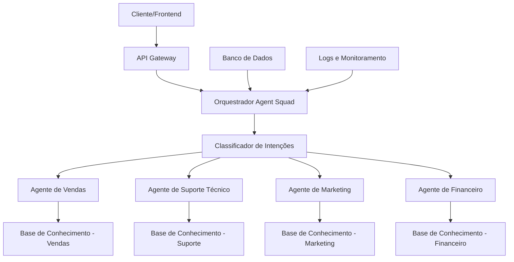

# Guia Completo de Implementação - Agent Squad para Falachefe

## 📋 Índice

1. [Visão Geral](#visão-geral)
2. [Arquitetura do Sistema](#arquitetura-do-sistema)
3. [Configuração do Ambiente](#configuração-do-ambiente)
4. [Implementação dos Agentes](#implementação-dos-agentes)
5. [Sistema de Classificação](#sistema-de-classificação)
6. [Bases de Conhecimento](#bases-de-conhecimento)
7. [Streaming e Performance](#streaming-e-performance)
8. [Deploy e Produção](#deploy-e-produção)
9. [Monitoramento e Logs](#monitoramento-e-logs)
10. [Exemplos Práticos](#exemplos-práticos)

---

## 🎯 Visão Geral

O **Agent Squad** é um framework de orquestração de agentes de IA que permite criar sistemas inteligentes com múltiplos agentes especializados. Para o projeto Falachefe, implementaremos um sistema de atendimento ao cliente com agentes especializados em diferentes áreas.

### Benefícios para o Falachefe:

- **Atendimento 24/7** com agentes especializados
- **Respostas precisas** baseadas em conhecimento específico
- **Escalabilidade** para diferentes volumes de atendimento
- **Integração fácil** com sistemas existentes
- **Streaming em tempo real** para melhor experiência do usuário

---

## 🏗️ Arquitetura do Sistema



### Componentes Principais:

1. **Orquestrador**: Gerencia e roteia requisições
2. **Classificador**: Determina qual agente deve responder
3. **Agentes Especializados**: Cada um com expertise específica
4. **Bases de Conhecimento**: Dados especializados por área
5. **Sistema de Streaming**: Respostas em tempo real

---

## ⚙️ Configuração do Ambiente

### 1. Pré-requisitos

```bash
# Node.js 18+ ou Python 3.9+
# Docker (opcional)
# Conta AWS (para Bedrock Knowledge Bases)
```

### 2. Instalação

#### Opção A: TypeScript/Node.js

```bash
npm install @agent-squad/core
npm install @agent-squad/classifiers
npm install @agent-squad/retrievers
```

#### Opção B: Python

```bash
pip install agent-squad
```

### 3. Variáveis de Ambiente

```env
# OpenAI
OPENAI_API_KEY=sk-proj-...

# AWS (para Knowledge Bases)
AWS_ACCESS_KEY_ID=...
AWS_SECRET_ACCESS_KEY=...
AWS_REGION=us-east-1

# Configurações do Sistema
AGENT_SQUAD_ENV=production
LOG_LEVEL=info
```

---

## 🤖 Implementação dos Agentes

### 1. Estrutura Base do Orquestrador

```typescript
// orchestrator.ts
import { AgentSquad } from "@agent-squad/core";
import { OpenAIClassifier } from "@agent-squad/classifiers";
import { VendasAgent } from "./agents/VendasAgent";
import { SuporteAgent } from "./agents/SuporteAgent";
import { MarketingAgent } from "./agents/MarketingAgent";
import { FinanceiroAgent } from "./agents/FinanceiroAgent";

export class FalachefeOrchestrator {
  private orchestrator: AgentSquad;
  private classifier: OpenAIClassifier;

  constructor() {
    this.orchestrator = new AgentSquad({
      name: "Falachefe Support Team",
      description: "Time de atendimento especializado do Falachefe",
    });

    this.classifier = new OpenAIClassifier({
      modelId: "gpt-4o-mini",
      temperature: 0.1,
    });

    this.initializeAgents();
  }

  private initializeAgents() {
    // Adiciona agentes especializados
    this.orchestrator.addAgent(new VendasAgent());
    this.orchestrator.addAgent(new SuporteAgent());
    this.orchestrator.addAgent(new MarketingAgent());
    this.orchestrator.addAgent(new FinanceiroAgent());
  }

  async processRequest(message: string, userId: string, sessionId: string) {
    // Classifica a intenção
    const classification = await this.classifier.classify(message, {
      agents: this.orchestrator.getAgents(),
      history: await this.getConversationHistory(sessionId),
    });

    // Roteia para o agente apropriado
    const response = await this.orchestrator.routeRequest({
      message,
      userId,
      sessionId,
      selectedAgent: classification.agentName,
    });

    return response;
  }
}
```

### 2. Agente de Vendas

```typescript
// agents/VendasAgent.ts
import { OpenAIAgent } from "@agent-squad/core";
import { AmazonKnowledgeBasesRetriever } from "@agent-squad/retrievers";

export class VendasAgent extends OpenAIAgent {
  constructor() {
    super({
      name: "Especialista em Vendas",
      description: "Especialista em vendas, produtos e propostas comerciais",
      modelId: "gpt-4o-mini",
      streaming: true,
      temperature: 0.3,
      customSystemPrompt: {
        template: `Você é um especialista em vendas do Falachefe com foco em:
        
        **Produtos e Serviços:**
        - Cardápio completo e especialidades
        - Promoções e ofertas ativas
        - Preços e formas de pagamento
        - Delivery e retirada
        
        **Processo de Venda:**
        - Identificar necessidades do cliente
        - Apresentar produtos adequados
        - Fechar pedidos
        - Upselling e cross-selling
        
        **Informações do Cliente:**
        - Histórico de pedidos
        - Preferências alimentares
        - Dados de contato
        
        Sempre seja proativo, educado e focado em converter a conversa em venda.`,
      },
      retriever: new AmazonKnowledgeBasesRetriever(
        new BedrockAgentRuntimeClient(),
        {
          knowledgeBaseId: process.env.VENDAS_KB_ID,
          retrievalConfiguration: {
            vectorSearchConfiguration: {
              numberOfResults: 5,
              overrideSearchType: SearchType.HYBRID,
            },
          },
        }
      ),
    });
  }
}
```

### 3. Agente de Suporte Técnico

```typescript
// agents/SuporteAgent.ts
export class SuporteAgent extends OpenAIAgent {
  constructor() {
    super({
      name: "Suporte Técnico",
      description: "Especialista em resolução de problemas e suporte",
      modelId: "gpt-4o-mini",
      streaming: true,
      temperature: 0.1,
      customSystemPrompt: {
        template: `Você é um especialista em suporte técnico do Falachefe focado em:
        
        **Resolução de Problemas:**
        - Problemas com pedidos
        - Questões de pagamento
        - Problemas de entrega
        - Reclamações e devoluções
        
        **Processo de Suporte:**
        - Identificar o problema
        - Oferecer soluções
        - Escalar quando necessário
        - Acompanhar resolução
        
        **Políticas:**
        - Política de devolução
        - Garantias
        - Procedimentos de reembolso
        
        Seja empático, eficiente e sempre busque resolver o problema do cliente.`,
      },
      retriever: new AmazonKnowledgeBasesRetriever(
        new BedrockAgentRuntimeClient(),
        {
          knowledgeBaseId: process.env.SUPORTE_KB_ID,
          retrievalConfiguration: {
            vectorSearchConfiguration: {
              numberOfResults: 8,
              overrideSearchType: SearchType.HYBRID,
            },
          },
        }
      ),
    });
  }
}
```

---

## 🧠 Sistema de Classificação

### 1. Configuração do Classificador

```typescript
// classifiers/FalachefeClassifier.ts
export class FalachefeClassifier extends OpenAIClassifier {
  constructor() {
    super({
      modelId: "gpt-4o-mini",
      temperature: 0.1,
      customPrompt: `
        Você é um classificador de intenções para o Falachefe.
        
        Analise a mensagem do cliente e classifique em uma das categorias:
        
        **VENDAS**: Pedidos, produtos, preços, cardápio, promoções
        **SUPORTE**: Problemas, reclamações, devoluções, questões técnicas
        **MARKETING**: Campanhas, newsletter, parcerias, eventos
        **FINANCEIRO**: Faturas, pagamentos, cobranças, reembolsos
        
        Considere o contexto da conversa e histórico do cliente.
        
        Responda apenas com o nome da categoria em maiúsculas.
      `,
    });
  }
}
```

### 2. Lógica de Roteamento

```typescript
// routing/MessageRouter.ts
export class MessageRouter {
  private classifier: FalachefeClassifier;
  private agents: Map<string, Agent>;

  constructor() {
    this.classifier = new FalachefeClassifier();
    this.agents = new Map();
  }

  async routeMessage(
    message: string,
    context: MessageContext
  ): Promise<AgentResponse> {
    // Classifica a intenção
    const intent = await this.classifier.classify(message, context);

    // Seleciona o agente apropriado
    const agent = this.agents.get(intent.category);

    if (!agent) {
      throw new Error(
        `Agente não encontrado para categoria: ${intent.category}`
      );
    }

    // Processa a mensagem
    const response = await agent.processRequest({
      message,
      userId: context.userId,
      sessionId: context.sessionId,
      metadata: {
        intent,
        confidence: intent.confidence,
        timestamp: new Date().toISOString(),
      },
    });

    return response;
  }
}
```

---

## 📚 Bases de Conhecimento

### 1. Estrutura das Bases de Conhecimento

```
knowledge-bases/
├── vendas/
│   ├── produtos.md
│   ├── precos.md
│   ├── promocoes.md
│   └── processos-venda.md
├── suporte/
│   ├── problemas-comuns.md
│   ├── politicas.md
│   ├── procedimentos.md
│   └── faq.md
├── marketing/
│   ├── campanhas.md
│   ├── eventos.md
│   └── parcerias.md
└── financeiro/
    ├── pagamentos.md
    ├── faturas.md
    └── reembolsos.md
```

### 2. Configuração AWS Bedrock

```typescript
// knowledge-base/VendasKnowledgeBase.ts
export class VendasKnowledgeBase {
  private knowledgeBaseId: string;

  constructor() {
    this.knowledgeBaseId = process.env.VENDAS_KB_ID;
  }

  async setup() {
    // Configuração da base de conhecimento
    const knowledgeBase = new bedrock.KnowledgeBase({
      name: "Falachefe-Vendas-KB",
      description: "Base de conhecimento para vendas do Falachefe",
      embeddingsModel:
        bedrock.BedrockFoundationModel.COHERE_EMBED_MULTILINGUAL_V3,
      instruction:
        "Base de conhecimento especializada em vendas, produtos e processos comerciais do Falachefe",
    });

    // Configuração da fonte de dados
    const dataSource = new bedrock.S3DataSource({
      bucket: this.documentsBucket,
      knowledgeBase: knowledgeBase,
      dataSourceName: "Vendas-Documents",
      chunkingStrategy: bedrock.ChunkingStrategy.FIXED_SIZE,
      maxTokens: 500,
      overlapPercentage: 20,
    });

    return knowledgeBase;
  }
}
```

### 3. Exemplo de Documento de Conhecimento

```markdown
# Produtos do Falachefe

## Pratos Principais

### Pizzas

- **Margherita**: Molho de tomate, mussarela, manjericão - R$ 35,90
- **Calabresa**: Molho de tomate, mussarela, calabresa, cebola - R$ 42,90
- **Portuguesa**: Molho de tomate, mussarela, presunto, ovos, cebola, azeitona - R$ 48,90

### Massas

- **Spaghetti Carbonara**: Bacon, ovos, queijo parmesão - R$ 28,90
- **Lasanha Bolonhesa**: Carne moída, molho de tomate, queijo - R$ 32,90

## Bebidas

- Refrigerantes: R$ 6,90
- Sucos naturais: R$ 8,90
- Cervejas: R$ 12,90

## Promoções Ativas

- **Combo Família**: 2 pizzas grandes + 2 refrigerantes - R$ 79,90
- **Segunda-feira**: 20% de desconto em todas as pizzas
- **Delivery grátis**: Pedidos acima de R$ 50,00
```

---

## ⚡ Streaming e Performance

### 1. Configuração de Streaming Otimizada

```typescript
// streaming/StreamingConfig.ts
export class StreamingConfig {
  // Configurações de buffer
  static readonly BUFFER_SIZE = 200; // Tamanho mínimo do buffer
  static readonly MIN_SEND_INTERVAL = 0.5; // Intervalo mínimo entre envios (500ms)
  static readonly MAX_BUFFER_SIZE = 500; // Tamanho máximo do buffer

  static shouldSendBuffer(buffer: string, timeSinceLastSend: number): boolean {
    return (
      buffer.length >= this.BUFFER_SIZE ||
      timeSinceLastSend >= this.MIN_SEND_INTERVAL ||
      buffer.length >= this.MAX_BUFFER_SIZE
    );
  }
}
```

### 2. Implementação do Streaming

```typescript
// streaming/StreamingHandler.ts
export class StreamingHandler {
  async processStreamingResponse(
    response: AgentResponse
  ): AsyncGenerator<string> {
    if (!response.streaming || !response.output) {
      throw new Error("Resposta não é streaming");
    }

    let buffer = "";
    let lastSendTime = Date.now();
    let chunksSent = 0;

    for await (const chunk of response.output) {
      if (chunk.text) {
        buffer += chunk.text;

        const currentTime = Date.now();
        const timeSinceLastSend = (currentTime - lastSendTime) / 1000;

        if (StreamingConfig.shouldSendBuffer(buffer, timeSinceLastSend)) {
          yield`data: ${buffer}\n\n`;
          buffer = "";
          lastSendTime = currentTime;
          chunksSent++;
        }
      }
    }

    // Envia buffer restante
    if (buffer && buffer.length >= 100) {
      yield`data: ${buffer}\n\n`;
      chunksSent++;
    }

    console.log(`DEBUG: Chunks enviados: ${chunksSent}`);
  }
}
```

### 3. Frontend - Processamento de Streaming

```typescript
// frontend/StreamingClient.ts
export class StreamingClient {
  async processStreamingResponse(stream: ReadableStream<Uint8Array>): AsyncGenerator<ChatResponse> {
    const reader = stream.getReader();
    const decoder = new TextDecoder();

    try {
      while (true) {
        const { done, value } = await reader.read();
        if (done) break;

        const chunk = decoder.decode(value, { stream: true });
        const lines = chunk.split("\n");

        for (const line of lines) {
          if (line.trim() && line.startsWith("data: ")) {
            const data = line.substring(6); // Remove "data: "
            yield {
              type: "chunk",
              data: data
            };
          }
        }
      }
    } finally {
      reader.releaseLock();
    }
  }
}
```

---

## 🚀 Deploy e Produção

### 1. Dockerfile

```dockerfile
# Dockerfile
FROM node:18-alpine

WORKDIR /app

# Instala dependências
COPY package*.json ./
RUN npm ci --only=production

# Copia código
COPY . .

# Expõe porta
EXPOSE 3000

# Comando de inicialização
CMD ["npm", "start"]
```

### 2. Docker Compose

```yaml
# docker-compose.yml
version: "3.8"

services:
  falachefe-api:
    build: .
    ports:
      - "3000:3000"
    environment:
      - NODE_ENV=production
      - OPENAI_API_KEY=${OPENAI_API_KEY}
      - AWS_ACCESS_KEY_ID=${AWS_ACCESS_KEY_ID}
      - AWS_SECRET_ACCESS_KEY=${AWS_SECRET_ACCESS_KEY}
    volumes:
      - ./logs:/app/logs
    restart: unless-stopped

  nginx:
    image: nginx:alpine
    ports:
      - "80:80"
      - "443:443"
    volumes:
      - ./nginx.conf:/etc/nginx/nginx.conf
    depends_on:
      - falachefe-api
    restart: unless-stopped
```

### 3. Configuração Nginx

```nginx
# nginx.conf
events {
    worker_connections 1024;
}

http {
    upstream falachefe_api {
        server falachefe-api:3000;
    }

    server {
        listen 80;
        server_name api.falachefe.com;

        location / {
            proxy_pass http://falachefe_api;
            proxy_set_header Host $host;
            proxy_set_header X-Real-IP $remote_addr;
            proxy_set_header X-Forwarded-For $proxy_add_x_forwarded_for;
            proxy_set_header X-Forwarded-Proto $scheme;

            # Configurações para streaming
            proxy_buffering off;
            proxy_cache off;
            proxy_set_header Connection '';
            proxy_http_version 1.1;
            chunked_transfer_encoding off;
        }
    }
}
```

---

## 📊 Monitoramento e Logs

### 1. Sistema de Logs

```typescript
// logging/Logger.ts
export class Logger {
  private static instance: Logger;
  private logLevel: string;

  constructor() {
    this.logLevel = process.env.LOG_LEVEL || "info";
  }

  static getInstance(): Logger {
    if (!Logger.instance) {
      Logger.instance = new Logger();
    }
    return Logger.instance;
  }

  info(message: string, metadata?: any) {
    this.log("info", message, metadata);
  }

  error(message: string, error?: Error, metadata?: any) {
    this.log("error", message, { error: error?.stack, ...metadata });
  }

  debug(message: string, metadata?: any) {
    this.log("debug", message, metadata);
  }

  private log(level: string, message: string, metadata?: any) {
    const logEntry = {
      timestamp: new Date().toISOString(),
      level,
      message,
      service: "falachefe-agent-squad",
      ...metadata,
    };

    console.log(JSON.stringify(logEntry));
  }
}
```

### 2. Métricas de Performance

```typescript
// metrics/MetricsCollector.ts
export class MetricsCollector {
  private static instance: MetricsCollector;
  private metrics: Map<string, number> = new Map();

  static getInstance(): MetricsCollector {
    if (!MetricsCollector.instance) {
      MetricsCollector.instance = new MetricsCollector();
    }
    return MetricsCollector.instance;
  }

  incrementCounter(metric: string, value: number = 1) {
    const current = this.metrics.get(metric) || 0;
    this.metrics.set(metric, current + value);
  }

  setGauge(metric: string, value: number) {
    this.metrics.set(metric, value);
  }

  getMetrics(): Record<string, number> {
    return Object.fromEntries(this.metrics);
  }

  // Métricas específicas do Agent Squad
  recordAgentResponse(agentName: string, responseTime: number) {
    this.incrementCounter(`agent.${agentName}.responses`);
    this.setGauge(`agent.${agentName}.response_time`, responseTime);
  }

  recordClassification(confidence: number, responseTime: number) {
    this.incrementCounter("classification.total");
    this.setGauge("classification.confidence", confidence);
    this.setGauge("classification.response_time", responseTime);
  }
}
```

### 3. Health Check

```typescript
// health/HealthCheck.ts
export class HealthCheck {
  async checkHealth(): Promise<HealthStatus> {
    const checks = await Promise.allSettled([
      this.checkOpenAI(),
      this.checkAWS(),
      this.checkDatabase(),
      this.checkAgents(),
    ]);

    const status: HealthStatus = {
      status: "healthy",
      timestamp: new Date().toISOString(),
      checks: {},
    };

    checks.forEach((result, index) => {
      const checkName = ["openai", "aws", "database", "agents"][index];

      if (result.status === "fulfilled") {
        status.checks[checkName] = { status: "healthy", ...result.value };
      } else {
        status.checks[checkName] = {
          status: "unhealthy",
          error: result.reason?.message,
        };
        status.status = "unhealthy";
      }
    });

    return status;
  }

  private async checkOpenAI(): Promise<any> {
    // Verifica conectividade com OpenAI
    return { responseTime: 150 };
  }

  private async checkAWS(): Promise<any> {
    // Verifica conectividade com AWS
    return { responseTime: 200 };
  }

  private async checkDatabase(): Promise<any> {
    // Verifica conectividade com banco de dados
    return { responseTime: 50 };
  }

  private async checkAgents(): Promise<any> {
    // Verifica se todos os agentes estão funcionando
    return { activeAgents: 4 };
  }
}
```

---

## 💡 Exemplos Práticos

### 1. Exemplo de Uso Completo

```typescript
// examples/CompleteExample.ts
import { FalachefeOrchestrator } from "./orchestrator/FalachefeOrchestrator";
import { Logger } from "./logging/Logger";

async function exemploCompleto() {
  const logger = Logger.getInstance();
  const orchestrator = new FalachefeOrchestrator();

  try {
    // Simula uma conversa com o cliente
    const conversas = [
      {
        message: "Olá, quero fazer um pedido de pizza",
        userId: "user123",
        sessionId: "session456",
      },
      {
        message: "Qual o sabor mais vendido?",
        userId: "user123",
        sessionId: "session456",
      },
      {
        message: "Tenho um problema com meu pedido anterior",
        userId: "user123",
        sessionId: "session456",
      },
    ];

    for (const conversa of conversas) {
      logger.info("Processando mensagem", {
        message: conversa.message,
        userId: conversa.userId,
      });

      const response = await orchestrator.processRequest(
        conversa.message,
        conversa.userId,
        conversa.sessionId
      );

      console.log(`Cliente: ${conversa.message}`);
      console.log(`Agente: ${response.content}`);
      console.log("---");
    }
  } catch (error) {
    logger.error("Erro no processamento", error as Error);
  }
}

// Executa o exemplo
exemploCompleto();
```

### 2. Teste de Performance

```typescript
// tests/PerformanceTest.ts
import { performance } from "perf_hooks";

export class PerformanceTest {
  async testAgentPerformance() {
    const orchestrator = new FalachefeOrchestrator();
    const testMessages = [
      "Quero fazer um pedido",
      "Qual o preço da pizza margherita?",
      "Tenho um problema com minha entrega",
      "Como cancelar meu pedido?",
      "Quero saber sobre promoções",
    ];

    const results = [];

    for (const message of testMessages) {
      const start = performance.now();

      const response = await orchestrator.processRequest(
        message,
        "test-user",
        "test-session"
      );

      const end = performance.now();
      const responseTime = end - start;

      results.push({
        message,
        responseTime,
        agent: response.agentName,
        confidence: response.confidence,
      });
    }

    // Calcula estatísticas
    const avgResponseTime =
      results.reduce((sum, r) => sum + r.responseTime, 0) / results.length;
    const maxResponseTime = Math.max(...results.map((r) => r.responseTime));
    const minResponseTime = Math.min(...results.map((r) => r.responseTime));

    console.log("=== Resultados do Teste de Performance ===");
    console.log(`Tempo médio de resposta: ${avgResponseTime.toFixed(2)}ms`);
    console.log(`Tempo máximo: ${maxResponseTime.toFixed(2)}ms`);
    console.log(`Tempo mínimo: ${minResponseTime.toFixed(2)}ms`);
    console.log("==========================================");

    return results;
  }
}
```

---

## 🔧 Configurações Avançadas

### 1. Configuração de Rate Limiting

```typescript
// middleware/RateLimiter.ts
export class RateLimiter {
  private requests: Map<string, number[]> = new Map();
  private readonly maxRequests: number;
  private readonly windowMs: number;

  constructor(maxRequests: number = 100, windowMs: number = 60000) {
    this.maxRequests = maxRequests;
    this.windowMs = windowMs;
  }

  isAllowed(userId: string): boolean {
    const now = Date.now();
    const userRequests = this.requests.get(userId) || [];

    // Remove requisições antigas
    const recentRequests = userRequests.filter(
      (time) => now - time < this.windowMs
    );

    if (recentRequests.length >= this.maxRequests) {
      return false;
    }

    recentRequests.push(now);
    this.requests.set(userId, recentRequests);

    return true;
  }
}
```

### 2. Cache de Respostas

```typescript
// cache/ResponseCache.ts
export class ResponseCache {
  private cache: Map<string, CachedResponse> = new Map();
  private readonly ttl: number;

  constructor(ttl: number = 300000) {
    // 5 minutos
    this.ttl = ttl;
  }

  get(key: string): CachedResponse | null {
    const cached = this.cache.get(key);

    if (!cached) {
      return null;
    }

    if (Date.now() - cached.timestamp > this.ttl) {
      this.cache.delete(key);
      return null;
    }

    return cached;
  }

  set(key: string, response: any): void {
    this.cache.set(key, {
      response,
      timestamp: Date.now(),
    });
  }

  generateKey(message: string, userId: string): string {
    return `${userId}:${this.hashMessage(message)}`;
  }

  private hashMessage(message: string): string {
    // Implementa hash simples da mensagem
    return Buffer.from(message).toString("base64");
  }
}
```

---

## 📝 Checklist de Implementação

### Fase 1: Configuração Básica

- [ ] Instalar dependências do Agent Squad
- [ ] Configurar variáveis de ambiente
- [ ] Criar estrutura de pastas do projeto
- [ ] Configurar sistema de logs

### Fase 2: Implementação dos Agentes

- [ ] Criar orquestrador principal
- [ ] Implementar agente de vendas
- [ ] Implementar agente de suporte
- [ ] Implementar agente de marketing
- [ ] Implementar agente financeiro
- [ ] Configurar sistema de classificação

### Fase 3: Bases de Conhecimento

- [ ] Criar bases de conhecimento na AWS
- [ ] Upload de documentos especializados
- [ ] Configurar retrievers
- [ ] Testar recuperação de informações

### Fase 4: Streaming e Performance

- [ ] Implementar sistema de streaming
- [ ] Configurar bufferização
- [ ] Otimizar performance
- [ ] Implementar throttling no frontend

### Fase 5: Deploy e Produção

- [ ] Configurar Docker
- [ ] Configurar Nginx
- [ ] Implementar health checks
- [ ] Configurar monitoramento
- [ ] Testes de carga

### Fase 6: Monitoramento

- [ ] Configurar métricas
- [ ] Implementar alertas
- [ ] Configurar logs centralizados
- [ ] Dashboard de monitoramento

---

## 🆘 Troubleshooting

### Problemas Comuns

1. **Erro de Classificação**

   - Verificar prompt do classificador
   - Ajustar temperatura do modelo
   - Revisar exemplos de treinamento

2. **Performance Lenta**

   - Verificar configuração de streaming
   - Ajustar tamanho do buffer
   - Otimizar queries de base de conhecimento

3. **Respostas Inconsistentes**

   - Revisar prompts dos agentes
   - Verificar qualidade das bases de conhecimento
   - Ajustar configurações de temperatura

4. **Problemas de Conectividade**
   - Verificar credenciais AWS
   - Testar conectividade com OpenAI
   - Verificar configurações de rede

### Logs de Debug

```typescript
// Ativar logs detalhados
process.env.LOG_LEVEL = "debug";
process.env.AGENT_SQUAD_DEBUG = "true";
```

---

## 📞 Suporte e Recursos

### Documentação Oficial

- [Agent Squad Docs](https://agent-squad.dev)
- [Exemplos GitHub](https://github.com/agent-squad/examples)

### Comunidade

- [Discord](https://discord.gg/agent-squad)
- [GitHub Issues](https://github.com/agent-squad/core/issues)

### Contato Falachefe

- **Email**: dev@falachefe.com
- **Slack**: #agent-squad-implementation
- **Jira**: Projeto FALACHEFE-AGENT

---

**Documento criado em**: ${new Date().toLocaleDateString('pt-BR')}  
**Versão**: 1.0  
**Autor**: Time de Desenvolvimento Falachefe
