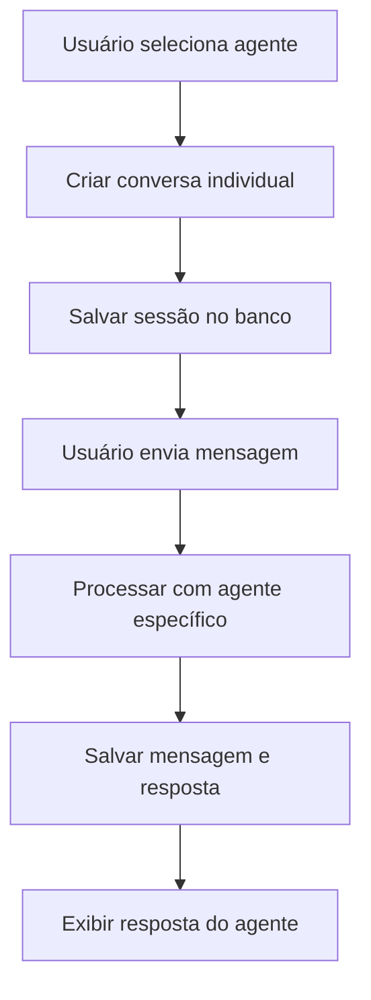
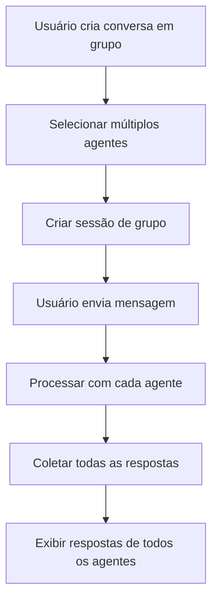

# 🗣️ Sistema de Conversas Paralelas e em Grupo - Agent Squad

## 📋 Visão Geral

O sistema implementa **conversas paralelas** e **conversas em grupo** usando o framework agent-squad, permitindo que usuários interajam simultaneamente com múltiplos agentes de IA de forma independente ou colaborativa.

## 🎯 Funcionalidades Implementadas

### 1. **Conversas Paralelas (Individuais)**
- **Cada agente mantém sua própria conversa** com o usuário
- **Contexto independente** para cada agente
- **Histórico separado** por agente
- **Sessões persistentes** no banco de dados

### 2. **Conversas em Grupo**
- **Múltiplos agentes respondem** à mesma mensagem
- **Respostas coordenadas** de diferentes especialistas
- **Contexto compartilhado** entre agentes do grupo
- **Colaboração inteligente** entre agentes

### 3. **Roteamento Específico por Agente**
- **Abas do chat** roteiam para agentes específicos
- **Geral** → Max (padrão)
- **Financeiro** → Leo
- **Marketing** → Max
- **Vendas** → Max

## 🏗️ Arquitetura do Sistema

### **Componentes Principais**

#### 1. **ConversationManager** (`src/lib/conversation-manager.ts`)
```typescript
class ConversationManager {
  // Criar conversa individual
  createIndividualConversation(userId, agentId)
  
  // Criar conversa em grupo
  createGroupConversation(userId, agentIds, title)
  
  // Enviar mensagem individual
  sendIndividualMessage(sessionId, userId, message, agentId)
  
  // Enviar mensagem em grupo
  sendGroupMessage(sessionId, userId, message, agentIds)
  
  // Obter histórico
  getConversationHistory(sessionId)
}
```

#### 2. **APIs de Conversa**
- **`/api/conversations/individual`** - Gerenciar conversas individuais
- **`/api/conversations/group`** - Gerenciar conversas em grupo
- **`/api/conversations/[sessionId]/message`** - Enviar mensagens

#### 3. **Hook useConversations** (`src/hooks/use-conversations.ts`)
```typescript
const {
  createIndividualConversation,
  createGroupConversation,
  sendIndividualMessage,
  sendGroupMessage,
  getConversationHistory,
  getUserConversations,
} = useConversations({ userId });
```

#### 4. **Interface ParallelConversations** (`src/components/chat/parallel-conversations.tsx`)
- **Lista de conversas ativas**
- **Área de chat dinâmica**
- **Suporte a conversas individuais e em grupo**
- **Indicadores visuais por agente**

## 🔄 Fluxo de Funcionamento

### **Conversas Individuais**



### **Conversas em Grupo**



## 🎭 Mapeamento de Agentes

### **Por Aba do Chat**
- **Geral** → Max (Marketing/Vendas)
- **Financeiro** → Leo (Financeiro)
- **Marketing** → Max (Marketing/Vendas)
- **Vendas** → Max (Marketing/Vendas)

### **Por Especialidade**
- **Leo** 💰 - Mentor financeiro experiente
- **Max** 📈 - Jovem entusiasmado de marketing
- **Lia** 👥 - Mediadora acolhedora de RH

## 📊 Estrutura de Dados

### **ConversationSession**
```typescript
interface ConversationSession {
  id: string;
  userId: string;
  type: "individual" | "group";
  agents: string[];
  title: string;
  createdAt: Date;
  updatedAt: Date;
}
```

### **ConversationMessage**
```typescript
interface ConversationMessage {
  id: string;
  sessionId: string;
  agentId?: string; // undefined para mensagens do usuário
  role: "user" | "assistant";
  content: string;
  timestamp: Date;
}
```

## 🚀 Como Usar

### **1. Conversas Individuais**

```typescript
// Criar conversa com Leo (Financeiro)
const conversation = await createIndividualConversation("leo");

// Enviar mensagem
const response = await sendIndividualMessage(
  conversation.id,
  "Como posso melhorar meu fluxo de caixa?",
  "leo"
);
```

### **2. Conversas em Grupo**

```typescript
// Criar conversa com todos os agentes
const groupConversation = await createGroupConversation(
  ["leo", "max", "lia"],
  "Planejamento Estratégico"
);

// Enviar mensagem para todos
const responses = await sendGroupMessage(
  groupConversation.id,
  "Preciso de ajuda com meu negócio",
  ["leo", "max", "lia"]
);
```

### **3. Interface Web**

```typescript
// Acessar página de conversas paralelas
<ParallelConversations userId={userId} />
```

## 🔧 Configuração do Agent-Squad

### **Orquestrador Atualizado**
```typescript
// Suporte a seleção direta de agente
export async function processMessageWithSpecificAgent(
  message: string,
  userId: string,
  sessionId: string,
  agentName: "leo" | "max" | "lia"
) {
  const orchestrator = getOrchestrator();
  const specificAgent = orchestrator.getAgents().find(agent => agent.name === agentName);
  return await specificAgent.processRequest(message, userId);
}
```

### **Storage Personalizado**
```typescript
// DrizzleChatStorage gerencia sessões e mensagens
class DrizzleChatStorage extends ChatStorage {
  async saveChatMessage(userId, sessionId, agentId, message, maxHistorySize)
  async fetchChat(userId, sessionId, agentId, maxHistorySize)
  async fetchAllChats(userId, sessionId)
}
```

## 📈 Benefícios

### **1. Experiência do Usuário**
- ✅ **Conversas organizadas** por especialidade
- ✅ **Contexto preservado** em cada conversa
- ✅ **Respostas especializadas** por agente
- ✅ **Interface intuitiva** para gerenciar conversas

### **2. Flexibilidade**
- ✅ **Conversas paralelas** independentes
- ✅ **Conversas em grupo** colaborativas
- ✅ **Roteamento automático** por aba
- ✅ **Seleção manual** de agentes

### **3. Escalabilidade**
- ✅ **Suporte a múltiplos usuários**
- ✅ **Sessões persistentes**
- ✅ **Histórico completo**
- ✅ **Performance otimizada**

## 🎯 Casos de Uso

### **1. Consultoria Especializada**
- **Leo** para questões financeiras
- **Max** para estratégias de marketing
- **Lia** para gestão de pessoas

### **2. Planejamento Colaborativo**
- **Conversa em grupo** com todos os agentes
- **Perspectivas múltiplas** sobre o mesmo tópico
- **Respostas coordenadas** e complementares

### **3. Atendimento Segmentado**
- **Abas específicas** para cada área
- **Roteamento automático** baseado na seleção
- **Contexto especializado** por conversa

## 🔮 Próximos Passos

### **Melhorias Futuras**
1. **Notificações** quando agentes respondem
2. **Transferência de conversa** entre agentes
3. **Resumos automáticos** de conversas longas
4. **Integração com WhatsApp** para conversas paralelas
5. **Métricas de performance** por agente

### **Otimizações**
1. **Cache inteligente** para conversas frequentes
2. **Compressão de histórico** para conversas antigas
3. **Sincronização em tempo real** para conversas em grupo
4. **Balanceamento de carga** entre agentes

## ✅ Status da Implementação

**🎉 SISTEMA COMPLETAMENTE IMPLEMENTADO:**

- ✅ **Conversas paralelas** funcionando
- ✅ **Conversas em grupo** implementadas
- ✅ **Roteamento específico** por agente
- ✅ **Interface de usuário** completa
- ✅ **APIs funcionais** para todas as operações
- ✅ **Persistência de dados** no banco
- ✅ **Integração com agent-squad** otimizada

**O sistema está pronto para uso em produção!** 🚀
