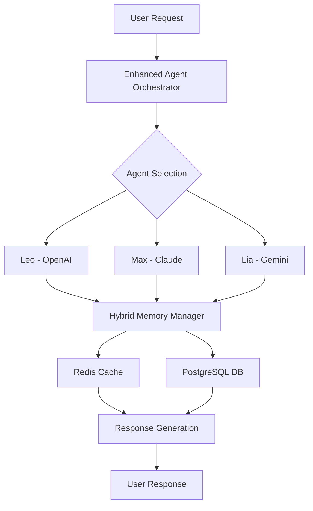

# FalaChefe v4 - Architecture Document

## Introduction

This is the **UNIFIED** architecture document for FalaChefe v4, consolidating both the current brownfield state and the planned Agent Squad enhancement. This document replaces the fragmented architecture documentation and serves as the single source of truth.

### Document Scope

**Current State + Enhancement**: Complete system architecture including existing functionality and the Agent Squad phased hybrid enhancement implementation.

### Change Log

| Date   | Version | Description                 | Author    |
| ------ | ------- | --------------------------- | --------- |
| 2025-01-29 | 2.0     | Unified architecture document | Winston (Architect) |

## Document Navigation

### For Current System Understanding
- **Section 2**: Current Architecture & Tech Stack
- **Section 3**: Existing Implementation Status
- **Section 4**: Technical Debt & Constraints

### For Agent Squad Development  
- **Section 5**: Enhancement Architecture
- **Section 6**: Phased Implementation Plan
- **Section 7**: Integration Points & APIs

### For Reference
- **Section 8**: Quick Reference Files
- **Section 9**: Development Guidelines

---

## 2. CURRENT ARCHITECTURE & TECH STACK

### 2.1 Technical Summary

**Runtime Environment**: Next.js 15 + TypeScript + Node.js 18+
**Database**: PostgreSQL (Supabase) + Drizzle ORM
**Authentication**: Supabase Auth + JWT
**Deployment**: Vercel (Frontend) + Supabase (Backend)
**AI Integration**: OpenAI API + Custom Agent Squad Library

### 2.2 Repository Structure Reality

- **Type**: Monorepo with hybrid Python/TypeScript
- **Package Manager**: pnpm (lock file present)
- **Notable**: Mixed Python agents + TypeScript frontend

```text
FalaChefe_v4/
├── src/
│   ├── app/                    # Next.js App Router
│   │   ├── api/               # API routes (chat, auth, etc.)
│   │   ├── dashboard/         # Admin interface
│   │   └── (auth)/           # Authentication pages
│   ├── agents/               # Python AI agents (Leo, Max, Lia)
│   ├── components/           # React components
│   ├── lib/                  # Core libraries
│   │   ├── orchestrator/     # Agent orchestration
│   │   ├── db.ts            # Database connection
│   │   └── schema.ts        # Drizzle schemas
│   └── hooks/               # React hooks
├── docs/                     # Documentation
├── scripts/                 # Utility scripts
└── requirements.txt         # Python dependencies
```

### 2.3 Key Modules and Their Purpose

- **Agent Orchestration**: `src/lib/orchestrator/enhanced-agent-squad.ts` - Core agent management
- **Session Management**: `src/lib/orchestrator/session-manager.ts` - User session handling
- **Database Layer**: `src/lib/db.ts` - Drizzle ORM setup
- **Authentication**: Supabase Auth integration
- **WhatsApp Integration**: `src/lib/uazapi-service.ts` - External API integration

## 3. EXISTING IMPLEMENTATION STATUS

### 3.1 Current Agent Squad Status

**✅ IMPLEMENTED:**
- Basic agent orchestration framework
- Leo (OpenAI), Max (Claude), Lia (Gemini) agents
- Session-based conversation management
- PostgreSQL conversation storage
- Admin panel for agent management

**⚠️ PARTIAL:**
- Agent specialization (basic personality, needs enhancement)
- Memory management (PostgreSQL-only, needs Redis hybrid)
- Performance optimization (works for ~100 users, needs scaling)

**❌ MISSING:**
- Hybrid memory system (Redis + PostgreSQL)
- Advanced agent specialization
- Multi-channel orchestration
- Brazilian business context integration

### 3.2 Current Performance Characteristics

- **Concurrent Users**: ~100 users supported
- **Response Time**: 2-5 seconds average
- **Database Queries**: PostgreSQL-only, some optimization needed
- **Memory Usage**: Session-based, limited persistence

## 4. TECHNICAL DEBT & CONSTRAINTS

### 4.1 Critical Technical Debt

1. **Session Manager TODOs**: Multiple critical TODOs in session management
2. **Mixed Language Architecture**: Python agents + TypeScript frontend complexity
3. **Database Optimization**: Some queries not optimized for scale
4. **Error Handling**: Inconsistent error handling patterns

### 4.2 Workarounds and Gotchas

- **Environment Variables**: Some hardcoded values need configuration
- **Agent Initialization**: Complex startup sequence for Python agents
- **Memory Management**: Current PostgreSQL-only approach has limitations

### 4.3 Integration Constraints

- **Supabase Limits**: Database connection limits and query optimization
- **Vercel Limits**: Function timeout constraints for long-running operations
- **Python Integration**: Node.js + Python interop complexity

## 5. ENHANCEMENT ARCHITECTURE (AGENT SQUAD)

### 5.1 Phased Hybrid Strategy

**Phase 1**: PostgreSQL Optimization (Weeks 1-6)
- Enhanced agent specialization
- Performance improvements
- Zero Redis dependency

**Phase 2**: Redis Hybrid Integration (Weeks 7-12)  
- Upstash Redis integration
- Hybrid memory system
- Enhanced performance

**Phase 3**: Advanced Features (Weeks 13-16)
- Brazilian business context
- Advanced orchestration
- Multi-channel support

### 5.2 New Architecture Components



### 5.3 Integration Points

- **Redis Integration**: Upstash Redis for session caching
- **Agent Enhancement**: Specialized prompts and context
- **Memory Management**: Hybrid Redis + PostgreSQL approach
- **Performance**: Caching and query optimization

## 6. PHASED IMPLEMENTATION PLAN

### 6.1 Phase 1: PostgreSQL Foundation (Weeks 1-6)

**Stories:**
1. Agent Specialization Enhancement
2. Database Query Optimization  
3. Session Management Improvement
4. Performance Monitoring Setup

**Deliverables:**
- Enhanced agent personalities
- Optimized database queries
- Improved session handling
- Performance baseline

### 6.2 Phase 2: Redis Hybrid (Weeks 7-12)

**Stories:**
1. Upstash Redis Integration
2. Hybrid Memory System
3. Cache Management
4. Performance Optimization

**Deliverables:**
- Redis integration
- Hybrid memory system
- Performance improvements
- Cache management

### 6.3 Phase 3: Advanced Features (Weeks 13-16)

**Stories:**
1. Brazilian Business Context
2. Advanced Orchestration
3. Multi-channel Support
4. Analytics & Monitoring

**Deliverables:**
- Brazilian business integration
- Advanced agent orchestration
- Multi-channel support
- Complete analytics

## 7. INTEGRATION POINTS & APIs

### 7.1 External Services

| Service  | Purpose  | Integration Type | Key Files                      |
| -------- | -------- | ---------------- | ------------------------------ |
| OpenAI   | Leo Agent | REST API         | `src/agents/squad/leo-openai-agent.ts` |
| Claude   | Max Agent | REST API         | `src/agents/squad/max-claude-agent.ts` |
| Gemini   | Lia Agent | REST API         | `src/agents/squad/lia-gemini-agent.ts` |
| Supabase | Auth/DB   | SDK              | `src/lib/db.ts`, auth integration |
| UAZAPI   | WhatsApp  | REST API         | `src/lib/uazapi-service.ts` |
| Upstash  | Redis     | REST API         | *(To be implemented)* |

### 7.2 Internal Integration Points

- **Frontend-Backend**: Next.js API routes
- **Agent Communication**: Orchestrator pattern
- **Database Access**: Drizzle ORM
- **Session Management**: Hybrid Redis + PostgreSQL

## 8. QUICK REFERENCE FILES

### 8.1 Critical Files for Development

- **Main Entry**: `src/app/page.tsx`
- **Agent Orchestration**: `src/lib/orchestrator/enhanced-agent-squad.ts`
- **Database Schema**: `src/lib/schema.ts`
- **Session Management**: `src/lib/orchestrator/session-manager.ts`
- **Configuration**: `drizzle.config.ts`, `env.example`

### 8.2 Key Configuration Files

- **Package Management**: `package.json`, `pnpm-lock.yaml`
- **Database**: `drizzle.config.ts`
- **Environment**: `env.example`
- **Deployment**: `vercel.json`, `next.config.ts`

## 9. DEVELOPMENT GUIDELINES

### 9.1 Code Organization

- **Components**: `src/components/` - React components
- **Pages**: `src/app/` - Next.js App Router pages
- **API Routes**: `src/app/api/` - Backend endpoints
- **Libraries**: `src/lib/` - Core business logic
- **Agents**: `src/agents/` - Python AI agents

### 9.2 Development Standards

- **TypeScript**: Strict typing required
- **Error Handling**: Consistent error patterns
- **Testing**: Unit and integration tests
- **Documentation**: JSDoc for complex functions
- **Performance**: Monitor query performance

### 9.3 Deployment Considerations

- **Vercel**: Frontend deployment
- **Supabase**: Database and auth
- **Environment Variables**: Secure configuration
- **Monitoring**: Performance and error tracking

---

## 10. CONCLUSION

This unified architecture document provides the complete picture of FalaChefe v4's current state and planned Agent Squad enhancement. The phased hybrid approach ensures safe, incremental delivery while maximizing value at each phase.

For implementation details, refer to:
- **Epic**: `docs/epics/epic-agent-squad-phased-hybrid.md`
- **PRD**: `docs/business/PRD_Agent_Squad_Unified_v3.md`
- **Brownfield Details**: `docs/brownfield-architecture.md`

