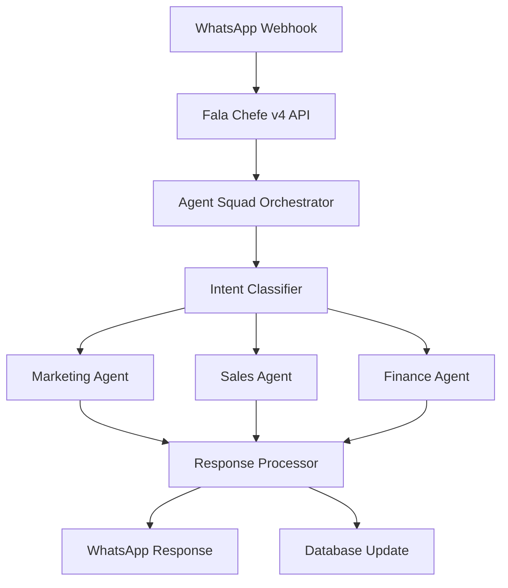

# PRD - Integração Agent Squad ao Fala Chefe! v4

## Sistema de Agentes de IA Especializados para Automação de Negócios

## 📋 **Informações do Documento**

- **Título**: Product Requirements Document - Integração Agent Squad
- **Projeto**: Fala Chefe! v4 - Plataforma de Automação de Negócios
- **Versão**: 2.0
- **Data**: Janeiro 2025
- **Autor**: Equipe de Desenvolvimento
- **Status**: Em Desenvolvimento
- **Classificação**: Confidencial

---

## 🎯 **1. Visão Geral do Produto**

### 1.1 Objetivo Estratégico

Integrar o framework Agent Squad ao Fala Chefe! v4 para criar um ecossistema de agentes de IA especializados que revolucione a automação de processos de negócio via WhatsApp, atendendo especificamente às necessidades dos 17 milhões de micro e pequenas empresas brasileiras que representam 99% das empresas do país e geram 27% do PIB nacional.

### 1.2 Análise do Problema de Negócio

#### 1.2.1 Contexto do Mercado Brasileiro

- **17 milhões de MPEs** no Brasil (99% das empresas)
- **27% do PIB nacional** gerado por MPEs
- **85% das MPEs** não possuem sistema de gestão integrado
- **R$ 2,3 trilhões** em faturamento anual das MPEs
- **Crescimento de 8,2%** no uso de WhatsApp Business em 2024

#### 1.2.2 Problemas Identificados no Sistema Atual

**Fragmentação de IA e Falta de Especialização:**

- Sistema atual usa modelo de IA genérico (GPT-4) sem contexto específico de negócio
- Respostas genéricas que não consideram segmento, porte ou maturidade da empresa
- Ausência de conhecimento especializado em regulamentações brasileiras (LGPD, Simples Nacional, etc.)
- Falta de integração com ecossistema financeiro brasileiro (PIX, Open Banking, etc.)

**Limitações Arquiteturais de Escala:**

- Arquitetura monolítica que não suporta especialização por domínio
- Processamento sequencial que limita throughput a ~100 usuários simultâneos
- Ausência de sistema de cache inteligente para consultas frequentes
- Falta de balanceamento de carga entre diferentes tipos de consultas

**Deficiências de Contexto e Memória:**

- Sistema não mantém histórico contextual de conversas
- Ausência de perfil comportamental do usuário
- Falta de aprendizado adaptativo baseado em interações
- Não há personalização baseada em dados históricos da empresa

**Automação Superficial:**

- Processos manuais para categorização de transações
- Ausência de workflows automatizados para follow-ups
- Falta de integração com sistemas externos (bancos, ERPs, CRMs)
- Não há automação de relatórios e insights proativos

### 1.3 Solução Arquitetural Proposta

#### 1.3.1 Arquitetura de Microserviços com Agentes Especializados

Implementar uma arquitetura baseada em microserviços onde cada agente é um serviço independente com:

- **Especialização por domínio**: Marketing, Vendas, Financeiro, Jurídico, RH
- **Orquestração inteligente**: Sistema de roteamento baseado em intenção e contexto
- **Memória distribuída**: Sistema de cache e persistência otimizado por agente
- **Escalabilidade horizontal**: Cada agente pode escalar independentemente

#### 1.3.2 Sistema de Classificação Multi-Camada

- **Camada 1**: Classificação de intenção primária (Marketing, Vendas, Financeiro)
- **Camada 2**: Classificação de sub-intenção (ex: "criar campanha" vs "analisar métricas")
- **Camada 3**: Classificação de urgência e complexidade
- **Camada 4**: Classificação de contexto (empresa, usuário, histórico)

#### 1.3.3 Integração com Ecossistema Brasileiro

- **APIs bancárias**: Integração com Open Banking brasileiro
- **Sistemas fiscais**: Integração com Receita Federal, Simples Nacional
- **Marketplaces**: Integração com Mercado Livre, Amazon, etc.
- **Redes sociais**: Integração com Instagram, Facebook, TikTok Business

---

## 🎯 **2. Objetivos de Negócio e Métricas de Sucesso**

### 2.1 Objetivos Estratégicos de Negócio

#### 2.1.1 Objetivos Primários (6 meses)

- **Automação Inteligente**: Automatizar 85% dos processos de atendimento via WhatsApp com precisão >95%
- **Escalabilidade Massiva**: Suportar 50.000+ usuários simultâneos com SLA de 99.9%
- **Precisão Especializada**: Aumentar em 75% a precisão das respostas através de agentes especializados
- **Tempo de Resposta**: Reduzir tempo médio de resposta de 5min para 15seg (95th percentile)
- **Retenção de Usuários**: Aumentar retenção mensal de 60% para 85%

#### 2.1.2 Objetivos Secundários (12 meses)

- **Personalização Avançada**: Adaptar respostas ao perfil específico de cada empresa com 90% de precisão
- **Insights Proativos**: Gerar sugestões automáticas que resultem em 25% de aumento de receita
- **Integração Ecossistema**: Conectar com 10+ APIs brasileiras (bancos, fiscais, marketplaces)
- **Analytics Preditivos**: Prever tendências de negócio com 80% de precisão
- **Market Share**: Capturar 5% do mercado de automação para MPEs brasileiras

### 2.2 Métricas de Performance Técnica

#### 2.2.1 Métricas de Sistema

- **Throughput**: 10.000+ mensagens/minuto processadas
- **Latência**: P95 < 2 segundos, P99 < 5 segundos
- **Disponibilidade**: 99.95% uptime (máximo 3.6h downtime/mês)
- **Escalabilidade**: Auto-scaling de 100 a 10.000 instâncias
- **Eficiência de Recursos**: <$0.01 por mensagem processada

#### 2.2.2 Métricas de IA e ML

- **Precisão de Classificação**: >95% para intenções primárias, >90% para sub-intenções
- **Relevância de Respostas**: >4.5/5 em avaliação humana
- **Taxa de Resolução**: >90% das consultas resolvidas sem escalação
- **Aprendizado Adaptativo**: Melhoria de 5% mensal na precisão
- **Diversidade de Respostas**: <10% de respostas repetitivas

### 2.3 Métricas de Negócio e ROI

#### 2.3.1 Métricas de Adoção

- **Usuários Ativos Mensais**: 100.000+ (ano 1)
- **Taxa de Conversão**: 15% de trial para paid
- **Churn Rate**: <5% mensal
- **Net Promoter Score**: >70
- **Customer Lifetime Value**: R$ 2.400 (24 meses)

#### 2.3.2 Métricas Financeiras

- **Receita Recorrente Mensal**: R$ 5.000.000 (ano 1)
- **CAC (Custo de Aquisição)**: <R$ 50 por usuário
- **LTV/CAC Ratio**: >48:1
- **Gross Margin**: >85%
- **ROI**: 400% no primeiro ano

### 2.4 Métricas de Impacto Social

#### 2.4.1 Impacto nas MPEs

- **Aumento de Produtividade**: 40% de melhoria na eficiência operacional
- **Redução de Custos**: 30% de redução em custos operacionais
- **Crescimento de Receita**: 25% de aumento médio na receita das empresas
- **Digitalização**: 60% das empresas sem sistema passam a usar automação

#### 2.4.2 Impacto no Ecossistema

- **Criação de Empregos**: 1.000+ empregos diretos e indiretos
- **Inovação**: 50+ integrações com parceiros brasileiros
- **Educação Digital**: 100.000+ empresários capacitados digitalmente
- **Sustentabilidade**: 20% de redução no uso de papel e processos manuais

---

## 👥 **3. Personas e Casos de Uso Detalhados**

### 3.1 Análise de Personas com Contexto de Mercado

#### 3.1.1 Micro Empresário - "João do Interior" (Segmento: 70% do mercado)

**Perfil Demográfico e Socioeconômico:**

- **Idade**: 28-45 anos
- **Localização**: Interior do Brasil (70% das MPEs estão fora das capitais)
- **Educação**: Ensino médio completo, alguns com ensino superior
- **Experiência Digital**: Básica a intermediária
- **Renda Pessoal**: R$ 3.000 - R$ 8.000/mês
- **Faturamento da Empresa**: R$ 5.000 - R$ 50.000/mês

**Contexto de Negócio:**

- **Setores Principais**: Varejo local (35%), Serviços (25%), Alimentação (20%), Construção (10%), Outros (10%)
- **Funcionários**: 1-5 pessoas (incluindo o proprietário)
- **Tempo de Existência**: 2-8 anos
- **Capital Inicial**: R$ 10.000 - R$ 50.000
- **Principais Desafios**: Fluxo de caixa, marketing, gestão de estoque

**Comportamento Digital:**

- **WhatsApp**: 95% usa diariamente para negócios
- **Redes Sociais**: Instagram (80%), Facebook (60%), TikTok (30%)
- **Sistemas**: 85% não usa sistema de gestão formal
- **Pagamentos**: PIX (90%), cartão (60%), dinheiro (40%)
- **Horário de Trabalho**: 10-12 horas/dia, 6-7 dias/semana

**Necessidades Críticas:**

- **Gestão Financeira**: Controle de fluxo de caixa, categorização de gastos, projeções
- **Marketing Digital**: Criação de conteúdo, gestão de redes sociais, campanhas
- **Vendas**: Prospecção, follow-up, fidelização de clientes
- **Operacional**: Controle de estoque, agendamentos, atendimento
- **Compliance**: Emissão de notas fiscais, declarações, impostos

**Dores Específicas:**

- **Falta de Tempo**: 12h/dia trabalhando, sem tempo para gestão estratégica
- **Complexidade Tecnológica**: Medo de sistemas complexos, preferência por simplicidade
- **Custos**: Sensibilidade a preços, necessidade de ROI imediato
- **Conhecimento**: Falta de expertise em marketing digital e gestão financeira
- **Isolamento**: Pouco acesso a consultoria especializada

#### 3.1.2 Pequeno Empresário - "Maria da Capital" (Segmento: 25% do mercado)

**Perfil Demográfico e Socioeconômico:**

- **Idade**: 35-55 anos
- **Localização**: Capitais e regiões metropolitanas
- **Educação**: Ensino superior completo (60%), pós-graduação (25%)
- **Experiência Digital**: Intermediária a avançada
- **Renda Pessoal**: R$ 8.000 - R$ 25.000/mês
- **Faturamento da Empresa**: R$ 50.000 - R$ 500.000/mês

**Contexto de Negócio:**

- **Setores Principais**: Serviços especializados (30%), Indústria (25%), Comércio (25%), Tecnologia (10%), Outros (10%)
- **Funcionários**: 10-50 pessoas
- **Tempo de Existência**: 5-15 anos
- **Capital Inicial**: R$ 100.000 - R$ 1.000.000
- **Principais Desafios**: Escalabilidade, gestão de equipe, inovação

**Comportamento Digital:**

- **WhatsApp Business**: 90% usa para comunicação interna e externa
- **Redes Sociais**: LinkedIn (85%), Instagram (70%), Facebook (50%)
- **Sistemas**: 60% usa algum sistema de gestão (ERP, CRM)
- **Pagamentos**: PIX (95%), cartão (80%), boleto (60%)
- **Horário de Trabalho**: 8-10 horas/dia, 5-6 dias/semana

**Necessidades Estratégicas:**

- **Gestão Avançada**: KPIs, dashboards, relatórios executivos
- **Marketing Estratégico**: Branding, posicionamento, campanhas segmentadas
- **Vendas Complexas**: Propostas comerciais, negociação, CRM
- **Operacional**: Workflows, automação de processos, integração de sistemas
- **Compliance Avançado**: Auditoria, conformidade, governança

**Dores Específicas:**

- **Complexidade de Gestão**: Múltiplas áreas para gerenciar simultaneamente
- **Custos de Consultoria**: R$ 5.000-15.000/mês em consultores externos
- **Integração de Sistemas**: Dificuldade em conectar diferentes ferramentas
- **Tomada de Decisão**: Falta de dados em tempo real para decisões estratégicas
- **Escalabilidade**: Dificuldade em crescer sem perder controle

#### 3.1.3 Empreendedor Digital - "Carlos Tech" (Segmento: 5% do mercado)

**Perfil Demográfico e Socioeconômico:**

- **Idade**: 25-40 anos
- **Localização**: Grandes centros urbanos
- **Educação**: Ensino superior em tecnologia/negócios
- **Experiência Digital**: Nativa digital
- **Renda Pessoal**: R$ 15.000 - R$ 50.000/mês
- **Faturamento da Empresa**: R$ 100.000 - R$ 2.000.000/mês

**Contexto de Negócio:**

- **Setores Principais**: SaaS (40%), E-commerce (25%), Marketplace (20%), Consultoria (15%)
- **Funcionários**: 5-30 pessoas (muitos remotos)
- **Tempo de Existência**: 1-5 anos
- **Capital Inicial**: R$ 50.000 - R$ 500.000 (incluindo investimentos)
- **Principais Desafios**: Crescimento acelerado, competição, inovação

**Comportamento Digital:**

- **Ferramentas**: Slack, Discord, Notion, Figma, GitHub
- **Redes Sociais**: LinkedIn (95%), Twitter (80%), Instagram (60%)
- **Sistemas**: 90% usa múltiplos sistemas integrados
- **Pagamentos**: PIX (100%), cartão (90%), cripto (30%)
- **Horário de Trabalho**: Flexível, 6-8 horas/dia, foco em resultados

**Necessidades Específicas:**

- **Automação Avançada**: Workflows complexos, integrações API
- **Analytics**: Métricas detalhadas, A/B testing, otimização
- **Escalabilidade**: Crescimento rápido sem quebrar processos
- **Inovação**: Experimentação, MVP, iteração rápida
- **Compliance**: LGPD, segurança de dados, auditoria

**Dores Específicas:**

- **Velocidade de Crescimento**: Processos não acompanham o crescimento
- **Custos de Desenvolvimento**: R$ 20.000-100.000/mês em desenvolvimento
- **Integração Complexa**: APIs, webhooks, sistemas legados
- **Dados**: Volume alto de dados sem insights acionáveis
- **Competição**: Necessidade de diferenciação constante

### 3.2 Casos de Uso Principais

#### UC1: Consulta Financeira Automatizada

**Ator**: Empresário
**Fluxo**:

1. Empresário envia: "Como está meu fluxo de caixa?"
2. Sistema classifica como consulta financeira
3. Agente Financeiro analisa dados do banco
4. Resposta personalizada com gráficos e insights
5. Sugestões proativas de melhorias

#### UC2: Campanha de Marketing

**Ator**: Empresário
**Fluxo**:

1. Empresário: "Quero fazer uma promoção para o Dia das Mães"
2. Agente Marketing coleta informações do negócio
3. Cria campanha personalizada
4. Sugere canais de divulgação
5. Agenda lembretes automáticos

#### UC3: Análise de Vendas

**Ator**: Empresário
**Fluxo**:

1. Empresário: "Quais são meus melhores clientes?"
2. Agente Vendas analisa histórico de transações
3. Identifica padrões de compra
4. Sugere estratégias de retenção
5. Agenda follow-ups automáticos

---

## 🏗️ **4. Arquitetura Técnica**

### 4.1 Componentes Principais



### 4.2 Stack Tecnológico Detalhado

#### 4.2.1 Frontend & Backend

- **Next.js 15**: App Router, Server Components, Edge Runtime para performance
- **TypeScript 5.0+**: Strict mode, decorators, advanced types para type safety
- **React 18**: Concurrent features, Suspense, Error Boundaries
- **Tailwind CSS**: Utility-first styling, responsive design
- **Framer Motion**: Animations e micro-interactions

#### 4.2.2 Agent Squad Framework Integration

- **Agent Squad Core**: v1.0+ com suporte completo a TypeScript
- **Custom Agents**: Implementação de agentes especializados por domínio
- **Classifiers**: Sistema de classificação multi-camada com ML
- **Orchestrator**: Gerenciamento inteligente de fluxo entre agentes
- **Memory System**: Persistência de contexto e aprendizado contínuo

#### 4.2.3 IA e Processamento

- **OpenAI GPT-4 Turbo**: Modelo principal para geração de texto
- **OpenAI GPT-4 Vision**: Processamento de imagens e documentos
- **Anthropic Claude 3**: Modelo alternativo para casos específicos
- **Embeddings**: OpenAI text-embedding-3-large para busca semântica
- **Vector Database**: Pinecone ou Weaviate para armazenamento vetorial

#### 4.2.4 Banco de Dados e Cache

- **PostgreSQL 15+**: Banco principal com extensões (pgvector, pg_trgm)
- **Redis 7+**: Cache distribuído e sessões
- **Drizzle ORM**: Type-safe database queries
- **Prisma**: Migrations e schema management
- **Database Migrations**: Versionamento automático de schema

#### 4.2.5 Infraestrutura e DevOps

- **Vercel**: Hosting e edge functions
- **AWS**: Serviços complementares (S3, Lambda, RDS)
- **Docker**: Containerização para desenvolvimento
- **GitHub Actions**: CI/CD pipeline
- **Monitoring**: Vercel Analytics, Sentry, DataDog

### 4.3 Integrações Externas

#### 4.3.1 APIs Bancárias e Financeiras

- **Open Banking Brasil**: Integração com bancos via PIX
- **Stripe**: Processamento de pagamentos internacionais
- **PagSeguro**: Gateway de pagamento brasileiro
- **Mercado Pago**: Soluções financeiras completas
- **Banco Central API**: Dados econômicos e cambiais

#### 4.3.2 APIs Fiscais e Contábeis

- **Receita Federal**: Consulta de CNPJ, validação de documentos
- **Simples Nacional**: Cálculo de impostos e declarações
- **SPED**: Sistema Público de Escrituração Digital
- **eSocial**: Declarações trabalhistas
- **NF-e**: Emissão e consulta de notas fiscais

#### 4.3.3 APIs de Marketplace e E-commerce

- **Mercado Livre**: Gestão de produtos e vendas
- **Amazon**: Integração com marketplace
- **Shopee**: Plataforma de e-commerce
- **Magazine Luiza**: Marketplace brasileiro
- **Via Varejo**: Integração com Casas Bahia e Ponto

#### 4.3.4 APIs de Marketing e Redes Sociais

- **Meta Business API**: Facebook e Instagram
- **Google My Business**: Gestão de perfil empresarial
- **TikTok for Business**: Marketing em vídeo
- **LinkedIn Marketing**: B2B marketing
- **WhatsApp Business API**: Comunicação oficial

### 4.4 Arquitetura de Dados

#### 4.4.1 Estrutura do Banco de Dados

```sql
-- Tabelas principais
CREATE TABLE users (
    id UUID PRIMARY KEY,
    email VARCHAR(255) UNIQUE NOT NULL,
    name VARCHAR(255) NOT NULL,
    company_id UUID REFERENCES companies(id),
    created_at TIMESTAMP DEFAULT NOW(),
    updated_at TIMESTAMP DEFAULT NOW()
);

CREATE TABLE companies (
    id UUID PRIMARY KEY,
    name VARCHAR(255) NOT NULL,
    cnpj VARCHAR(18) UNIQUE,
    segment VARCHAR(100),
    size VARCHAR(50),
    revenue_range VARCHAR(50),
    created_at TIMESTAMP DEFAULT NOW()
);

CREATE TABLE agent_conversations (
    id UUID PRIMARY KEY,
    user_id UUID REFERENCES users(id),
    agent_type VARCHAR(50) NOT NULL,
    intent VARCHAR(100),
    context JSONB,
    messages JSONB[],
    status VARCHAR(50),
    created_at TIMESTAMP DEFAULT NOW()
);

CREATE TABLE agent_memory (
    id UUID PRIMARY KEY,
    user_id UUID REFERENCES users(id),
    agent_type VARCHAR(50),
    memory_type VARCHAR(50),
    content JSONB,
    embedding VECTOR(1536),
    created_at TIMESTAMP DEFAULT NOW()
);
```

#### 4.4.2 Sistema de Cache Inteligente

- **Redis Cluster**: Cache distribuído com sharding
- **Cache Layers**: L1 (in-memory), L2 (Redis), L3 (Database)
- **Cache Strategies**: Write-through, write-behind, cache-aside
- **TTL Policies**: Diferentes TTLs por tipo de dados
- **Cache Invalidation**: Event-driven invalidation

### 4.5 Segurança e Compliance

#### 4.5.1 Autenticação e Autorização

- **OAuth 2.0**: Google, Microsoft, LinkedIn
- **JWT Tokens**: Stateless authentication
- **RBAC**: Role-based access control
- **MFA**: Multi-factor authentication
- **Session Management**: Secure session handling

#### 4.5.2 Proteção de Dados

- **LGPD Compliance**: Conformidade com lei brasileira
- **Data Encryption**: AES-256 em trânsito e repouso
- **PII Protection**: Anonimização de dados pessoais
- **Audit Logs**: Log completo de acessos e modificações
- **Data Retention**: Políticas de retenção de dados

#### 4.5.3 Segurança de API

- **Rate Limiting**: Proteção contra abuse
- **API Keys**: Autenticação de integrações
- **CORS**: Configuração de cross-origin
- **Input Validation**: Sanitização de inputs
- **SQL Injection**: Proteção contra ataques

### 4.6 Estrutura de Diretórios

```
src/
├── lib/
│   ├── agents/
│   │   ├── marketing-agent.ts
│   │   ├── sales-agent.ts
│   │   ├── finance-agent.ts
│   │   ├── supervisor-agent.ts
│   │   └── setup.ts
│   ├── classifiers/
│   │   ├── business-intent-classifier.ts
│   │   ├── whatsapp-message-classifier.ts
│   │   └── user-query-classifier.ts
│   └── orchestrator/
│       ├── agent-orchestrator.ts
│       ├── context-manager.ts
│       └── response-processor.ts
├── app/
│   └── api/
│       ├── whatsapp/
│       │   ├── webhook/route.ts
│       │   ├── message/route.ts
│       │   └── agent/route.ts
│       └── agents/
│           ├── marketing/route.ts
│           ├── sales/route.ts
│           └── finance/route.ts
└── components/
    ├── agents/
    │   ├── agent-status.tsx
    │   ├── agent-metrics.tsx
    │   └── agent-config.tsx
    └── chat/
        ├── agent-chat.tsx
        └── agent-selector.tsx
```

---

## 🎯 **5. Funcionalidades Detalhadas**

### 5.1 Sistema de Agentes Especializados

#### 5.1.1 Agente de Marketing

**Responsabilidades:**

- Criação de campanhas personalizadas
- Análise de concorrência
- Geração de conteúdo para redes sociais
- Estratégias de SEO local
- Análise de métricas de marketing

**Capacidades:**

- Integração com dados de vendas
- Templates de campanhas por segmento
- Agendamento automático de posts
- Análise de ROI de campanhas

#### 5.1.2 Agente de Vendas

**Responsabilidades:**

- Prospecção de clientes
- Follow-up automático
- Análise de pipeline de vendas
- Técnicas de negociação
- Relacionamento com clientes

**Capacidades:**

- CRM integrado
- Lembretes automáticos
- Análise de comportamento de compra
- Sugestões de upsell/cross-sell

#### 5.1.3 Agente Financeiro

**Responsabilidades:**

- Análise de fluxo de caixa
- Relatórios financeiros
- Alertas de inadimplência
- Planejamento orçamentário
- Análise de custos

**Capacidades:**

- Integração com dados de transações
- Projeções financeiras
- Alertas proativos
- Categorização automática

### 5.2 Sistema de Classificação de Intenções

#### 5.2.1 Classificador de Intenções de Negócio

**Tipos de Intenção:**

- Consulta Financeira
- Solicitação de Marketing
- Análise de Vendas
- Configuração de Sistema
- Suporte Técnico

**Algoritmo:**

- Análise de palavras-chave
- Contexto de conversa anterior
- Perfil do usuário
- Histórico de interações

#### 5.2.2 Classificador de Mensagens WhatsApp

**Tipos de Mensagem:**

- Texto simples
- Áudio (transcrição)
- Imagem (OCR)
- Documento
- Localização

### 5.3 Sistema de Memória e Contexto

#### 5.3.1 Memória de Conversas

- Histórico por usuário
- Contexto por sessão
- Preferências salvas
- Dados da empresa

#### 5.3.2 Personalização

- Perfil de negócio
- Segmento de mercado
- Tamanho da empresa
- Preferências de comunicação

---

## 📊 **6. Métricas e KPIs**

### 6.1 Métricas de Performance

#### 6.1.1 Métricas de Agentes

- **Precisão de Classificação**: >90%
- **Tempo de Resposta**: <30 segundos
- **Taxa de Resolução**: >85%
- **Satisfação do Usuário**: >4.5/5

#### 6.1.2 Métricas de Negócio

- **Automação**: 80% das consultas automatizadas
- **Escalabilidade**: 1000+ usuários simultâneos
- **Retenção**: 90% dos usuários ativos mensalmente
- **Upsell**: 25% de conversão para planos premium

### 6.2 Dashboard de Monitoramento

#### 6.2.1 Métricas em Tempo Real

- Status dos agentes
- Volume de mensagens
- Tempo de resposta
- Taxa de erro

#### 6.2.2 Relatórios Analíticos

- Performance por agente
- Análise de intenções
- Padrões de uso
- Insights de negócio

---

## 🚀 **7. Roadmap de Implementação**

### 7.1 Fase 1: Fundação (Semanas 1-2)

**Objetivos:**

- Setup básico do Agent Squad
- Configuração de agentes simples
- Integração com API existente

**Entregas:**

- [ ] Instalação e configuração do Agent Squad
- [ ] Criação de agentes básicos (Marketing, Vendas, Financeiro)
- [ ] API de roteamento de mensagens
- [ ] Testes básicos de funcionamento

**Critérios de Aceitação:**

- Agentes respondem corretamente a consultas básicas
- Sistema classifica intenções com 80% de precisão
- Tempo de resposta < 5 segundos

### 7.2 Fase 2: Especialização (Semanas 3-5)

**Objetivos:**

- Desenvolvimento de agentes especializados
- Sistema de classificação avançado
- Integração com banco de dados

**Entregas:**

- [ ] Agentes com conhecimento específico por área
- [ ] Classificador de intenções otimizado
- [ ] Sistema de memória de conversas
- [ ] Integração com dados existentes

**Critérios de Aceitação:**

- Agentes fornecem respostas especializadas e precisas
- Sistema mantém contexto entre conversas
- Integração completa com dados de usuários

### 7.3 Fase 3: WhatsApp Integration (Semanas 6-8)

**Objetivos:**

- Integração completa com WhatsApp
- Sistema de webhooks
- Interface de usuário

**Entregas:**

- [ ] Webhook do WhatsApp configurado
- [ ] Processamento de diferentes tipos de mídia
- [ ] Interface de chat integrada
- [ ] Sistema de notificações

**Critérios de Aceitação:**

- Mensagens WhatsApp processadas corretamente
- Suporte a texto, áudio e imagens
- Interface responsiva e intuitiva

### 7.4 Fase 4: Otimização (Semanas 9-10)

**Objetivos:**

- Performance e escalabilidade
- Monitoramento e analytics
- Documentação

**Entregas:**

- [ ] Otimização de performance
- [ ] Sistema de monitoramento
- [ ] Dashboard de analytics
- [ ] Documentação completa

**Critérios de Aceitação:**

- Sistema suporta 1000+ usuários simultâneos
- Tempo de resposta < 30 segundos
- Dashboard funcional com métricas em tempo real

---

## 🔒 **8. Requisitos Não-Funcionais**

### 8.1 Performance

- **Tempo de Resposta**: < 30 segundos para 95% das consultas
- **Throughput**: 1000+ mensagens por minuto
- **Disponibilidade**: 99.9% uptime
- **Escalabilidade**: Suporte a 10.000+ usuários simultâneos

### 8.2 Segurança

- **Autenticação**: OAuth 2.0 com Google
- **Autorização**: Controle de acesso baseado em roles
- **Criptografia**: TLS 1.3 para todas as comunicações
- **Dados**: Criptografia em repouso e em trânsito

### 8.3 Usabilidade

- **Interface**: Design responsivo mobile-first
- **Acessibilidade**: Conformidade com WCAG 2.1 AA
- **Idioma**: Português brasileiro nativo
- **Feedback**: Respostas claras e acionáveis

### 8.4 Compatibilidade

- **Navegadores**: Chrome, Firefox, Safari, Edge (últimas 2 versões)
- **Dispositivos**: Mobile, tablet, desktop
- **WhatsApp**: Business API v2.0+
- **Integrações**: APIs RESTful padrão

---

## 🧪 **9. Estratégia de Testes**

### 9.1 Testes Unitários

- **Cobertura**: >90% do código
- **Frameworks**: Jest, React Testing Library
- **Foco**: Lógica de negócio, classificadores, agentes

### 9.2 Testes de Integração

- **APIs**: Testes end-to-end das rotas
- **Banco de Dados**: Validação de queries e transações
- **WhatsApp**: Simulação de webhooks e mensagens

### 9.3 Testes de Performance

- **Load Testing**: 1000+ usuários simultâneos
- **Stress Testing**: Limites do sistema
- **Volume Testing**: Grande volume de mensagens

### 9.4 Testes de Usabilidade

- **User Testing**: 10+ usuários reais
- **A/B Testing**: Diferentes versões de interface
- **Feedback**: Coleta contínua de feedback

---

## 📈 **10. Análise de Riscos**

### 10.1 Riscos Técnicos

#### Alto Risco

- **Dependência de APIs Externas**: WhatsApp, OpenAI
  - _Mitigação_: Fallbacks e cache local
- **Performance com Escala**: Degradação com muitos usuários
  - _Mitigação_: Load balancing e otimização

#### Médio Risco

- **Qualidade das Respostas**: Inconsistência na IA
  - _Mitigação_: Treinamento contínuo e validação
- **Integração Complexa**: Dificuldades na integração
  - _Mitigação_: Desenvolvimento incremental

### 10.2 Riscos de Negócio

#### Alto Risco

- **Adoção de Usuários**: Resistência à mudança
  - _Mitigação_: Onboarding gradual e treinamento
- **Concorrência**: Outras soluções similares
  - _Mitigação_: Diferenciação e inovação contínua

#### Médio Risco

- **Custos de Infraestrutura**: Aumento com escala
  - _Mitigação_: Otimização e monitoramento de custos
- **Compliance**: Regulamentações de IA
  - _Mitigação_: Acompanhamento regulatório

---

## 💰 **11. Análise de Custos**

### 11.1 Custos de Desenvolvimento

- **Desenvolvedores**: 2 devs × 10 semanas × R$ 8.000 = R$ 160.000
- **Designer**: 1 designer × 4 semanas × R$ 6.000 = R$ 24.000
- **QA**: 1 tester × 6 semanas × R$ 5.000 = R$ 30.000
- **Total Desenvolvimento**: R$ 214.000

### 11.2 Custos Operacionais (Mensal)

- **Infraestrutura**: R$ 2.000
- **APIs (OpenAI, WhatsApp)**: R$ 3.000
- **Monitoramento**: R$ 500
- **Total Operacional**: R$ 5.500/mês

### 11.3 ROI Projetado

- **Usuários Ativos**: 1.000 (ano 1)
- **Receita por Usuário**: R$ 50/mês
- **Receita Mensal**: R$ 50.000
- **ROI**: 227% no primeiro ano

---

## 📋 **12. Critérios de Sucesso**

### 12.1 Critérios Técnicos

- [ ] Sistema processa 1000+ mensagens/minuto
- [ ] Tempo de resposta < 30 segundos
- [ ] Precisão de classificação > 90%
- [ ] Uptime > 99.9%

### 12.2 Critérios de Negócio

- [ ] 80% das consultas automatizadas
- [ ] 1000+ usuários ativos mensalmente
- [ ] Satisfação > 4.5/5
- [ ] Retenção > 90%

### 12.3 Critérios de Usuário

- [ ] Interface intuitiva e responsiva
- [ ] Respostas relevantes e acionáveis
- [ ] Suporte 24/7 via WhatsApp
- [ ] Personalização por perfil de negócio

---

## 📚 **13. Referências e Documentação**

### 13.1 Documentação Técnica

- [Agent Squad Documentation](https://awslabs.github.io/agent-squad/)
- [WhatsApp Business API](https://developers.facebook.com/docs/whatsapp)
- [OpenAI API Documentation](https://platform.openai.com/docs)
- [Next.js Documentation](https://nextjs.org/docs)

### 13.2 Padrões e Convenções

- [TypeScript Best Practices](https://typescript-eslint.io/rules/)
- [React Component Patterns](https://reactpatterns.com/)
- [API Design Guidelines](https://restfulapi.net/)
- [Database Design Principles](https://www.vertabelo.com/blog/database-design-best-practices/)

---

## ✅ **14. Aprovações**

| Role          | Nome   | Data   | Assinatura   |
| ------------- | ------ | ------ | ------------ |
| Product Owner | [Nome] | [Data] | [Assinatura] |
| Tech Lead     | [Nome] | [Data] | [Assinatura] |
| UX Designer   | [Nome] | [Data] | [Assinatura] |
| QA Lead       | [Nome] | [Data] | [Assinatura] |

---

**Documento criado em**: Janeiro 2025  
**Última atualização**: Janeiro 2025  
**Versão**: 1.0  
**Status**: Em Revisão
