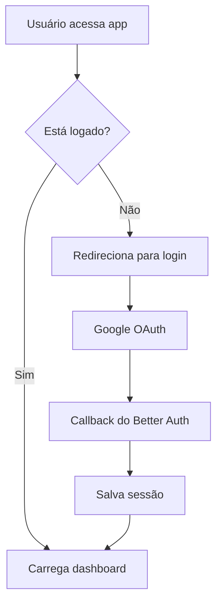
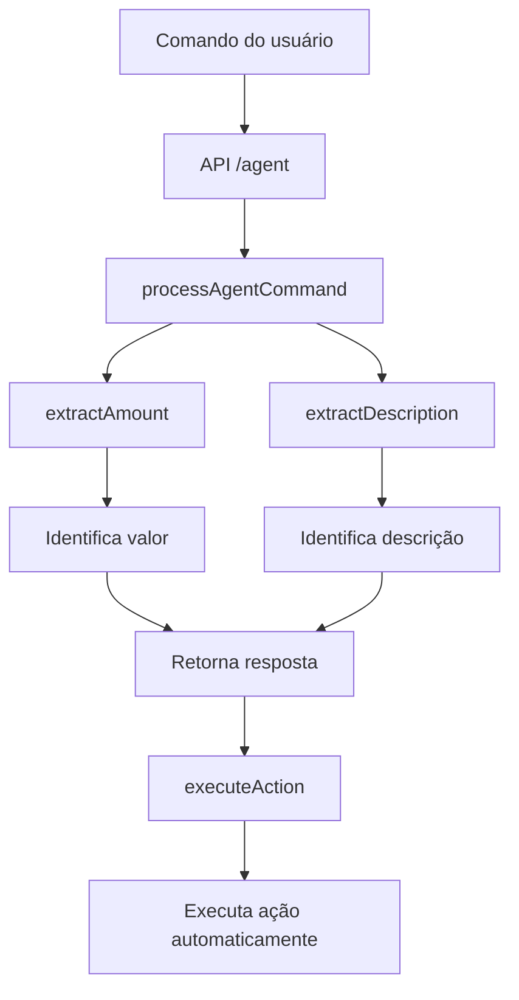

# Arquitetura do Sistema - Fala Chefe!

## Visão Geral

O "Fala Chefe!" é uma plataforma de automação de negócios construída com Next.js 15, TypeScript e integração com Better Auth. A arquitetura foi projetada para ser escalável, modular e fácil de manter.

## Stack Tecnológico

### Frontend

- **Next.js 15** com App Router
- **React 19** com hooks modernos
- **TypeScript** para tipagem estática
- **Tailwind CSS** para estilização
- **shadcn/ui** para componentes

### Backend

- **Next.js API Routes** para endpoints
- **Better Auth** para autenticação
- **Drizzle ORM** para banco de dados
- **PostgreSQL** como banco principal

### Integrações

- **Google OAuth** para autenticação
- **Vercel AI SDK** para processamento de IA
- **OpenAI** para comandos de linguagem natural

## Estrutura de Diretórios

```
src/
├── app/                    # App Router do Next.js
│   ├── api/               # API Routes
│   │   ├── agent/         # Agente de IA
│   │   ├── cashflow/      # Fluxo de caixa
│   │   ├── transactions/  # Transações
│   │   └── categories/    # Categorias
│   ├── cashflow/          # Página de fluxo de caixa
│   ├── dashboard/         # Dashboard principal
│   └── chat/              # Chat com IA
├── components/            # Componentes React
│   ├── auth/             # Componentes de autenticação
│   └── ui/               # Componentes de interface
├── hooks/                # Custom hooks
└── lib/                  # Utilitários e configurações
    ├── auth.ts           # Configuração do Better Auth
    ├── db.ts             # Configuração do banco
    └── schema.ts         # Schema do Drizzle
```

## Arquitetura de Dados

### Schema do Banco

```sql
-- Usuários (Better Auth)
user (id, name, email, emailVerified, image)

-- Planilhas de fluxo de caixa
spreadsheets (id, userId, name, googleSheetId, googleSheetUrl, isActive)

-- Categorias de transações
categories (id, userId, name, type, color, isActive)

-- Transações financeiras
transactions (id, userId, spreadsheetId, categoryId, description, amount, type, transactionDate)

-- Configurações do usuário
userSettings (id, userId, currency, timezone, whatsappNumber, preferences)

-- Histórico de comandos do agente
agentCommands (id, userId, command, response, success, metadata)
```

### Relacionamentos

- **1:N** - Usuário → Planilhas
- **1:N** - Usuário → Categorias
- **1:N** - Usuário → Transações
- **1:1** - Usuário → Configurações
- **1:N** - Usuário → Comandos do Agente
- **N:1** - Transação → Planilha
- **N:1** - Transação → Categoria

## Padrões de Arquitetura

### 1. API-First Design

Todas as funcionalidades são expostas via API REST:

```typescript
// Exemplo: API de transações
POST /api/transactions
GET /api/transactions?userId=123&type=receita
PUT /api/transactions/:id
DELETE /api/transactions/:id
```

### 2. Component-Based UI

Interface construída com componentes reutilizáveis:

```typescript
// Exemplo: Card de resumo financeiro
<Card>
  <CardHeader>
    <CardTitle>Resumo Financeiro</CardTitle>
  </CardHeader>
  <CardContent>{/* Conteúdo dinâmico */}</CardContent>
</Card>
```

### 3. Server-Side Rendering

Páginas renderizadas no servidor para melhor performance:

```typescript
// Exemplo: Página de dashboard
export default function DashboardPage() {
  // Lógica do componente
  return <div>Dashboard</div>;
}
```

## Fluxo de Autenticação



## Processamento de Comandos IA



## Segurança

### 1. Autenticação

- **Better Auth** com Google OAuth
- **JWT tokens** para sessões
- **Middleware** de autenticação em rotas protegidas

### 2. Validação de Dados

- **TypeScript** para tipagem estática
- **Validação** de entrada nas APIs
- **Sanitização** de dados do usuário

### 3. Banco de Dados

- **Conexão SSL** com PostgreSQL
- **Prepared statements** via Drizzle ORM
- **Foreign key constraints** para integridade

## Performance

### 1. Otimizações Frontend

- **Server-side rendering** para páginas estáticas
- **Lazy loading** de componentes
- **Code splitting** automático do Next.js

### 2. Otimizações Backend

- **Connection pooling** no banco de dados
- **Caching** de consultas frequentes
- **Compressão** de respostas HTTP

### 3. Monitoramento

- **Logs** estruturados
- **Métricas** de performance
- **Error tracking** com console.error

## Escalabilidade

### 1. Horizontal Scaling

- **Stateless** API routes
- **Database** separado da aplicação
- **CDN** para assets estáticos

### 2. Vertical Scaling

- **Otimização** de consultas SQL
- **Caching** de dados frequentes
- **Compressão** de respostas

## Deploy e Infraestrutura

### 1. Ambiente de Desenvolvimento

- **Next.js dev server** com Turbopack
- **PostgreSQL** local ou Supabase
- **Hot reload** para desenvolvimento

### 2. Ambiente de Produção

- **Vercel** para deploy automático
- **Supabase** para banco de dados
- **Google Cloud** para OAuth

## Monitoramento e Logs

### 1. Logs da Aplicação

```typescript
console.log("Comando processado:", command);
console.error("Erro ao processar:", error);
```

### 2. Logs do Banco

- **Queries** executadas
- **Performance** das consultas
- **Erros** de conexão

### 3. Métricas de Negócio

- **Comandos** processados por usuário
- **Transações** registradas
- **Tempo** de resposta das APIs

## Próximos Passos

### 1. Melhorias de Performance

- **Redis** para caching
- **CDN** para assets
- **Database indexing** otimizado

### 2. Funcionalidades Avançadas

- **WebSocket** para updates em tempo real
- **Background jobs** para processamento assíncrono
- **File upload** para documentos

### 3. Monitoramento Avançado

- **APM** (Application Performance Monitoring)
- **Error tracking** com Sentry
- **Analytics** de uso da aplicação
