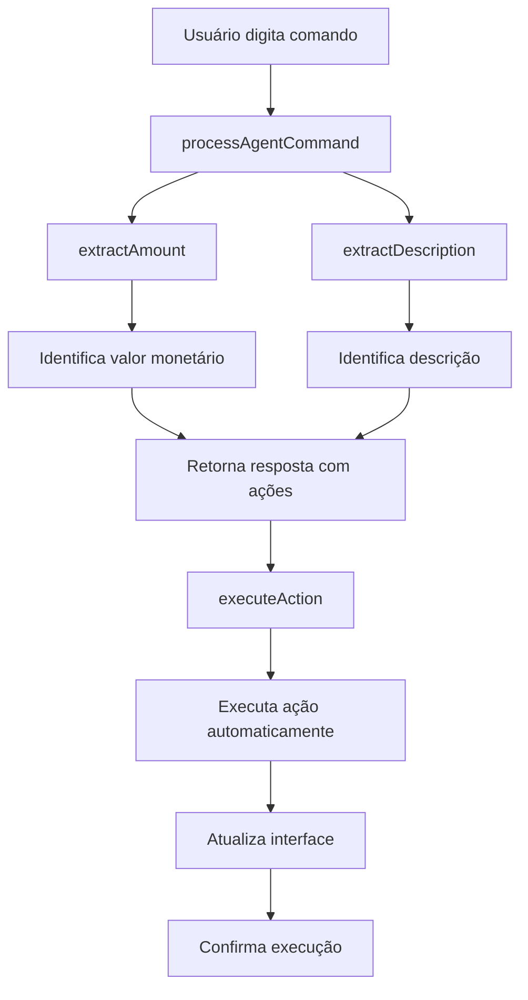

# Agente de Fluxo de Caixa - Fala Chefe!

## Visão Geral

O Agente de Fluxo de Caixa é um dos três agentes especializados da plataforma "Fala Chefe!" que permite aos micro empresários gerenciar suas finanças através de comandos em português natural via interface web.

## Funcionalidades

### 1. Processamento de Comandos Naturais

O agente entende comandos em português natural e executa ações automaticamente:

- **Registro de Receitas**: "Registre receita de R$ 500 da venda para cliente X"
- **Registro de Despesas**: "Registre despesa de R$ 300 de combustível"
- **Criação de Planilhas**: "Criar fluxo de caixa"
- **Consultas**: "Mostre resumo do mês"

### 2. Extração Inteligente de Valores

O agente reconhece múltiplos formatos de valores monetários:

- R$ 500,00
- R$ 500.00
- 500 reais
- 500,00 reais
- 500 real

### 3. Execução Automática de Ações

Quando o agente processa um comando, ele:

1. **Analisa** o comando em português natural
2. **Extrai** informações relevantes (valor, descrição, tipo)
3. **Executa** automaticamente a ação correspondente
4. **Confirma** a execução com feedback visual

## Arquitetura Técnica

### Componentes Principais

#### 1. API Route (`/api/agent`)

- **Arquivo**: `src/app/api/agent/route.ts`
- **Função**: Processa comandos e retorna respostas com ações sugeridas
- **Métodos**: POST

#### 2. Página de Interface (`/cashflow`)

- **Arquivo**: `src/app/cashflow/page.tsx`
- **Função**: Interface web para interação com o agente
- **Recursos**: Chat interface, resumo financeiro, histórico de transações

#### 3. Funções de Processamento

##### `processAgentCommand(userId, command)`

- Analisa comandos em português natural
- Extrai valores monetários e descrições
- Retorna resposta estruturada com ações sugeridas

##### `extractAmount(command)`

- Extrai valores monetários usando múltiplos padrões regex
- Suporta diferentes formatos de moeda brasileira

##### `extractDescription(command, type)`

- Extrai descrições das transações
- Remove palavras de comando para obter descrição limpa

### 4. Execução de Ações

#### `executeAction(action)`

- Executa automaticamente as ações sugeridas pelo agente
- Suporta:
  - `create_spreadsheet`: Criar nova planilha
  - `create_transaction`: Registrar transação
  - `get_cashflow_summary`: Obter resumo financeiro

## Fluxo de Funcionamento



## Exemplos de Uso

### Comando de Receita

```
Input: "Registre receita de R$ 1.500 da venda de produto A"
Output:
- ✅ Receita registrada!
- 💰 Valor: R$ 1.500
- 📝 Descrição: venda de produto A
- Transação salva automaticamente!
```

### Comando de Despesa

```
Input: "Registre despesa de 300 reais de combustível"
Output:
- ✅ Despesa registrada!
- 💰 Valor: R$ 300
- 📝 Descrição: de combustível
- Transação salva automaticamente!
```

### Comando de Criação

```
Input: "Criar fluxo de caixa"
Output:
- 📊 Criando fluxo de caixa...
- Vou configurar uma nova planilha com categorias padrão
- Planilha criada automaticamente!
```

## Integração com Banco de Dados

### Tabelas Utilizadas

1. **`agentCommands`**: Histórico de comandos processados
2. **`transactions`**: Transações financeiras registradas
3. **`spreadsheets`**: Planilhas de fluxo de caixa
4. **`categories`**: Categorias de transações

### Relacionamentos

- Cada comando é associado a um usuário
- Transações são vinculadas a planilhas e categorias
- Histórico de comandos é mantido para auditoria

## Configuração e Setup

### Variáveis de Ambiente

```env
POSTGRES_URL=postgres://...
GOOGLE_CLIENT_ID=...
GOOGLE_CLIENT_SECRET=...
```

### Dependências

- `nanoid`: Geração de IDs únicos
- `drizzle-orm`: ORM para banco de dados
- `better-auth`: Autenticação de usuários

## Próximos Passos

1. **Integração com Google Sheets**: Conectar com planilhas reais
2. **Processamento de Áudio**: Suporte a comandos de voz
3. **IA Avançada**: Integração com modelos de linguagem mais sofisticados
4. **Relatórios**: Geração automática de relatórios financeiros
5. **Alertas**: Notificações proativas sobre finanças

## Troubleshooting

### Problemas Comuns

1. **Valor não identificado**: Verificar formato do comando
2. **Ação não executada**: Verificar logs do console
3. **Erro de autenticação**: Verificar se usuário está logado

### Logs Importantes

- Comandos processados: `agentCommands` table
- Erros de processamento: Console do navegador
- Execução de ações: Network tab do DevTools
