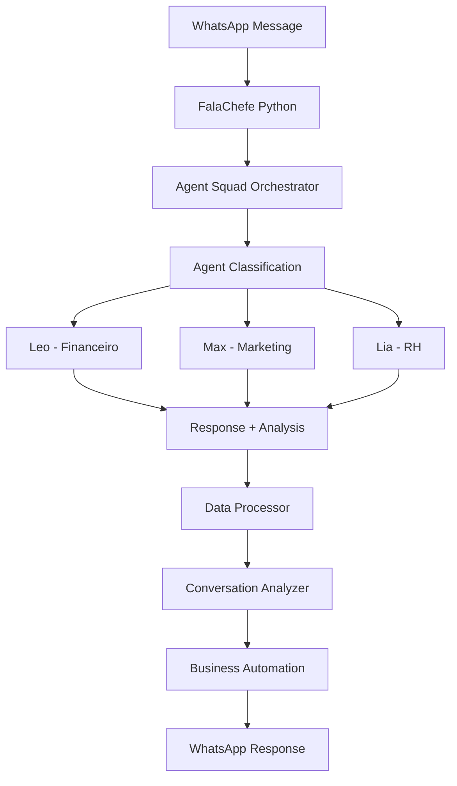

# FalaChefe v4 - Integração Python

## Visão Geral

A integração Python do FalaChefe v4 utiliza o **Agent Squad Framework Python nativo** para fornecer funcionalidades avançadas de processamento de dados, análise e automação de negócios. Esta integração trabalha em conjunto com o Agent Squad Framework TypeScript existente, complementando as funcionalidades dos agentes especializados.

## Arquitetura

### Componentes Principais

```
FalaChefe Python
├── Agent Squad Framework Python
│   ├── Leo (Financeiro) - Agente especializado
│   ├── Max (Marketing) - Agente especializado  
│   └── Lia (RH) - Agente especializado
├── Data Processor - Processamento de dados
├── API Client - Integração com APIs externas
├── Conversation Analyzer - Análise de conversas
└── Business Automation - Automação de negócios
```

### Fluxo de Dados



## Instalação

### Pré-requisitos

- Python 3.8+
- pip ou conda
- Variáveis de ambiente configuradas

### Instalação das Dependências

```bash
# Instalar dependências Python
pip install -r requirements.txt

# Ou com conda
conda install --file requirements.txt
```

### Configuração

1. Copie o arquivo de configuração:
```bash
cp .env.python.example .env.python
```

2. Configure as variáveis de ambiente:
```bash
# OpenAI
OPENAI_API_KEY=your_openai_api_key_here
OPENAI_MODEL=gpt-4-turbo-preview

# Supabase
SUPABASE_URL=your_supabase_url_here
SUPABASE_ANON_KEY=your_supabase_anon_key_here

# WhatsApp API
WHATSAPP_API_URL=your_whatsapp_api_url_here
WHATSAPP_API_TOKEN=your_whatsapp_api_token_here
```

## Uso

### Executando o Script Principal

```bash
# Health check
python main.py --mode health

# Processar conversa
python main.py --mode conversation --data '{"message": "Preciso de ajuda financeira", "user_id": "user123", "session_id": "session456"}'

# Análise financeira
python main.py --mode financial --data "financial_data_source"

# Análise de marketing
python main.py --mode marketing --data '{"name": "Campanha Q1", "type": "whatsapp"}'

# Processamento de RH
python main.py --mode hr --data '{"type": "payroll", "employees": 25}'

# Processamento em lote
python main.py --mode batch --batch-type financial
```

### Usando como Módulo Python

```python
import asyncio
from main import FalaChefePython

async def main():
    # Inicializa o FalaChefe Python
    falachefe = FalaChefePython()
    
    # Processa uma conversa
    conversation_data = {
        "id": "conv_001",
        "message": "Preciso de ajuda com marketing digital",
        "user_id": "user_123",
        "session_id": "session_456"
    }
    
    result = await falachefe.process_conversation(conversation_data)
    print(f"Resposta: {result['response']['message']}")
    print(f"Agente: {result['response']['agent_name']}")
    
    # Análise financeira
    financial_report = await falachefe.analyze_financial_data("monthly_data")
    print(f"Relatório: {financial_report['executive_summary']}")

# Executa
asyncio.run(main())
```

## Agentes Especializados

### Leo (Financeiro)

**Especialização**: Finanças, contabilidade, fluxo de caixa, investimentos

**Características**:
- Temperatura: 0.4 (respostas precisas)
- Base de conhecimento: DRE, fluxo de caixa, Simples Nacional, PIX, LGPD
- Prompt especializado em finanças empresariais

**Exemplo de uso**:
```python
# Processar com Leo especificamente
conversation_data = {
    "message": "Como calcular o fluxo de caixa?",
    "user_id": "user_123",
    "session_id": "session_456",
    "agent_name": "leo"
}

result = await falachefe.process_conversation(conversation_data)
```

### Max (Marketing)

**Especialização**: Marketing digital, vendas, campanhas, funil de vendas

**Características**:
- Temperatura: 0.6 (criatividade moderada)
- Base de conhecimento: Funil de vendas, marketing digital, WhatsApp Business, conteúdo
- Prompt especializado em marketing e vendas

**Exemplo de uso**:
```python
# Análise de campanha de marketing
campaign_data = {
    "name": "Campanha WhatsApp Q1",
    "platform": "whatsapp",
    "budget": 5000,
    "spent": 3200,
    "conversions": 45
}

result = await falachefe.process_marketing_campaign(campaign_data)
```

### Lia (RH)

**Especialização**: Recursos humanos, gestão de pessoas, processos de RH

**Características**:
- Temperatura: 0.5 (equilíbrio entre precisão e empatia)
- Base de conhecimento: Gestão de pessoas, CLT, home office, avaliação de desempenho
- Prompt especializado em RH e gestão de equipe

**Exemplo de uso**:
```python
# Processamento de operações de RH
hr_data = {
    "type": "payroll",
    "employees": 25,
    "month": "2025-01"
}

result = await falachefe.process_hr_operations(hr_data)
```

## Funcionalidades Avançadas

### Análise de Conversas

O sistema inclui análise avançada de conversas com:

- **Análise de Sentimento**: Detecta emoções nas mensagens
- **Classificação de Intenção**: Identifica o que o usuário quer
- **Análise de Complexidade**: Avalia a complexidade da mensagem
- **Extração de Entidades**: Identifica números, emails, telefones, valores

```python
# Obter analytics de conversas
analytics = await falachefe.conversation_analyzer.get_conversation_analytics("30d")
print(f"Total de conversas: {analytics['total_conversations']}")
print(f"Distribuição por agente: {analytics['agent_distribution']}")
```

### Automação de Negócios

Sistema de automação com tarefas agendadas:

- **Relatórios Financeiros Diários**: Geração automática às 8h
- **Análise de Campanhas Semanal**: Toda segunda-feira às 9h
- **Processamento de RH Mensal**: Todo dia 1 às 10h

```python
# Agendar tarefas de automação
await falachefe.business_automation.schedule_automation_tasks()

# Executar agendador
await falachefe.business_automation.run_scheduler()
```

### Processamento de Dados

Capacidades avançadas de processamento:

- **Análise Financeira**: Cálculos de ROI, margens, crescimento
- **Análise de Campanhas**: Métricas de marketing e conversão
- **Relatórios Automatizados**: Geração de relatórios executivos

```python
# Análise financeira detalhada
financial_data = await falachefe.data_processor.load_financial_data("api_source")
analysis = await falachefe.data_processor.analyze_financial_data(financial_data)
report = await falachefe.data_processor.generate_financial_report(analysis)
```

## Testes

### Executando Testes

```bash
# Todos os testes
pytest test_main.py -v

# Testes específicos
pytest test_main.py::TestFalaChefePython::test_process_conversation_success -v

# Com cobertura
pytest test_main.py --cov=src --cov-report=html
```

### Estrutura de Testes

```
test_main.py
├── TestFalaChefePython - Testes da classe principal
├── TestAgentSquadOrchestrator - Testes do orquestrador
├── TestDataProcessor - Testes do processador de dados
└── TestConversationAnalyzer - Testes do analisador
```

## Monitoramento e Logs

### Logs Estruturados

O sistema utiliza logging estruturado com diferentes níveis:

```python
# Configurar nível de log
import logging
logging.getLogger("falachefe").setLevel(logging.DEBUG)
```

### Health Check

```python
# Verificar saúde do sistema
health = await falachefe.health_check()
print(f"Status: {health['status']}")
print(f"Componentes: {health['components']}")
```

### Métricas

O sistema coleta métricas de:

- Tempo de resposta dos agentes
- Taxa de sucesso das conversas
- Satisfação do usuário
- Distribuição por agente
- Análise de sentimento

## Configuração Avançada

### Personalização de Agentes

```python
# Configurar agente personalizado
from src.core.agent_squad_orchestrator import FalaChefeAgentSquadOrchestrator

orchestrator = FalaChefeAgentSquadOrchestrator(config)

# Adicionar agente personalizado
custom_agent = create_custom_agent()
orchestrator.agent_squad.add_agent(custom_agent)
```

### Configuração de Retrievers

```python
# Personalizar retriever de conhecimento
from src.core.knowledge_retrievers import LeoKnowledgeRetriever

retriever = LeoKnowledgeRetriever(config)
# Adicionar conhecimento personalizado
await retriever.update_knowledge_base({
    "custom_topic": {
        "content": "Conhecimento personalizado",
        "keywords": ["custom", "personalizado"],
        "tags": ["custom"]
    }
})
```

## Troubleshooting

### Problemas Comuns

1. **Erro de conexão com OpenAI**
   - Verifique a chave da API
   - Confirme o modelo disponível

2. **Erro de conexão com Supabase**
   - Verifique URL e chaves
   - Confirme permissões da tabela

3. **Erro de conexão com WhatsApp**
   - Verifique URL e token da API
   - Confirme configuração do webhook

### Logs de Debug

```bash
# Executar com debug
python main.py --mode health --config .env.python.debug
```

## Contribuição

### Estrutura do Projeto

```
src/
├── agents/           # Agentes especializados
├── core/            # Componentes principais
├── analytics/       # Análise de dados
├── automation/      # Automação de negócios
└── utils/           # Utilitários
```

### Adicionando Novo Agente

1. Crie o agente em `src/agents/`
2. Implemente o retriever em `src/core/knowledge_retrievers.py`
3. Registre no orquestrador
4. Adicione testes

### Adicionando Nova Funcionalidade

1. Implemente a funcionalidade
2. Adicione testes unitários
3. Documente a API
4. Atualize este README

## Licença

MIT License - veja o arquivo [LICENSE](../../LICENSE) para detalhes.
