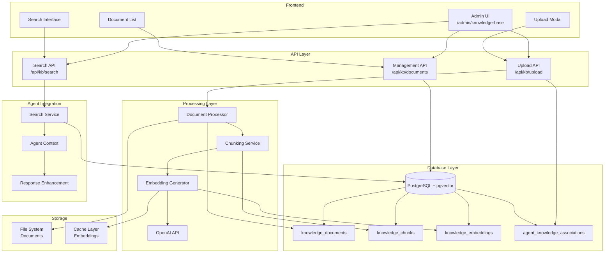

# Arquitetura da Base de Conhecimento com pgvector

## Diagrama de Arquitetura



## Fluxo de Upload de Documento


## Fluxo de Busca Semântica


## Estrutura de Dados

### Documento

```typescript
interface KnowledgeDocument {
  id: string;
  title: string;
  content: string;
  filePath?: string;
  fileType: "pdf" | "docx" | "txt" | "md" | "html";
  fileSize: number;
  metadata: Record<string, any>;
  agentId?: string;
  isGlobal: boolean;
  status: "processing" | "active" | "error";
  createdBy: string;
  createdAt: Date;
  updatedAt: Date;
}
```

### Chunk

```typescript
interface KnowledgeChunk {
  id: string;
  documentId: string;
  content: string;
  chunkIndex: number;
  tokenCount: number;
  metadata: Record<string, any>;
  createdAt: Date;
}
```

### Embedding

```typescript
interface KnowledgeEmbedding {
  id: string;
  chunkId: string;
  embedding: number[]; // 1536 dimensions
  model: string;
  createdAt: Date;
}
```

### Resultado de Busca

```typescript
interface SearchResult {
  document: KnowledgeDocument;
  chunk: KnowledgeChunk;
  similarityScore: number;
  relevanceScore: number;
  context: string;
}
```

## Configurações de Performance

### Chunking

- **Tamanho máximo**: 1000 tokens
- **Sobreposição**: 100 tokens
- **Estratégia**: Por parágrafo
- **Preservar estrutura**: Sim

### Embeddings

- **Modelo**: text-embedding-ada-002
- **Dimensões**: 1536
- **Batch size**: 100
- **Rate limit**: 3000/min

### Busca

- **Limite padrão**: 10 resultados
- **Threshold**: 0.7
- **Cache TTL**: 1 hora
- **Timeout**: 5 segundos

## Monitoramento

### Métricas de Sistema

- Documentos processados/min
- Latência de busca (p50, p95, p99)
- Taxa de erro de upload
- Uso de tokens OpenAI

### Métricas de Negócio

- Documentos por agente
- Buscas por dia
- Taxa de relevância
- Satisfação do usuário

### Alertas

- Falha de processamento > 5%
- Latência de busca > 2s
- Rate limit OpenAI
- Espaço em disco < 20%
